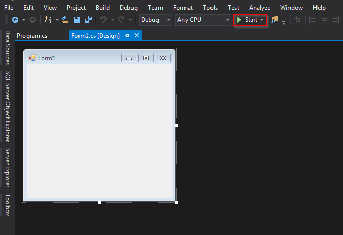
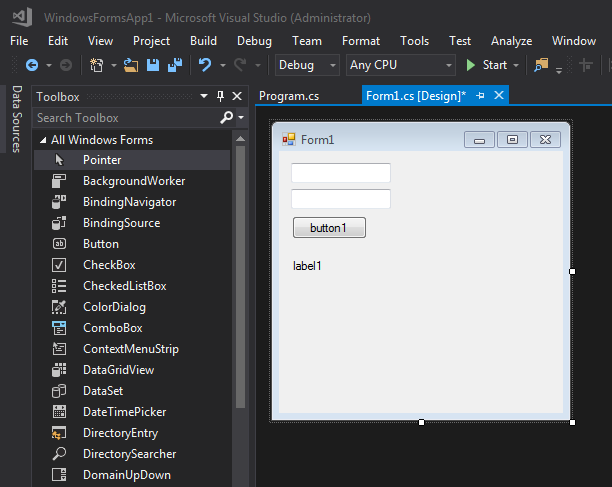
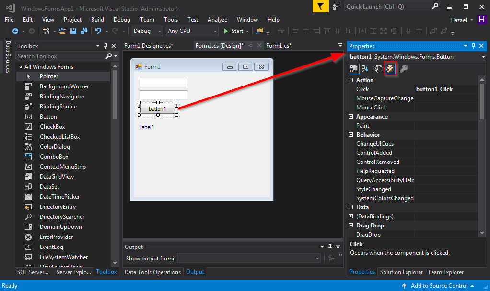

** Video de la clase **

[](http://www.youtube.com/watch?v=13hdxEc5Ypo)

1. Conocimientos básicos y Prerrequisitos
1. Vision general de Windows Forms
1. Creando un nuevo projecto Windows Forms
1. Añadiendo Controles
1. Cambio de propiedades y apariencia
1. Controladores de eventos
1. Entrada del usuario
1. Depuración del código
1. Clase de temporalizador

## 1 Conocimientos básicos y Prerrequisitos

Para seguir este curso necesitaras algunos conocimientos básicos, principalmente habilidades básicas de programación y al menos alguna experiencia en C#.

> C# es un lenguaje para la programación profesional. C# (pronunciado C sharp) es un lenguaje de programacion diseñado para la construccion de una amplia gama de aplicaciones empresariales que se ejecuta con el Framework .NET.
> El objetivo de C# es proporcionar un lenguaje simple, seguro, moderno, orientado a objetos, alto rendimiento , robusto y duradero para el desarrollo de .NET.
> Permite a los desarrolladores crear soluciones para la gama mas amplia de clientes, incluyendo aplicaciones web, aplicaciones basadas en Microsoft Windows Forms, y dispositivos de clientes inteligentes y delgados.
>
> [Tuturial y código fuente de C#](http://csharp.net-informations.com/)

Les sugiero que lean y hagan los ejemplos de las paginas siguientes **(Y si eres uno de mis estudiantes, entonces es una necesidad porque tendrá que contestar un cuestionario acerca de esto)**:

1. [Aplicaión basada en consolo de C#](http://csharp.net-informations.com/overview/csharp-console-application.htm)
1. [Como utilizar las sentencias if else en C#](http://csharp.net-informations.com/statements/csharp-if-else.htm)
1. [Como utilizar loop en C#](http://csharp.net-informations.com/statements/csharp-for-loop.htm)
1. [Como utilizar foreach loop en C#](http://csharp.net-informations.com/statements/csharp-foreach-loop.htm)
1. [Como utilizar while loop en C#](http://csharp.net-informations.com/statements/csharp-while-loop.htm)
1. [Como utilizar las sentencias del caso switch en C#](http://csharp.net-informations.com/statements/csharp-switch-case.htm)
1. Lee sólo un poco de programación orientada a objetos, no es necesario comprender por completo el alcancede este curso, pero puede resultar útil algún día [Progrmación Orientada a Objetos](https://docs.microsoft.com/en-us/dotnet/articles/csharp/programming-guide/concepts/object-oriented-programming)

El programa que necesita tener instalado debe ser cualquier versión de Visual Studio IDE, Recomiendo la versión community del último Visual Studio: [Visual Studio Community 2017](https://www.visualstudio.com/thank-you-downloading-visual-studio/?sku=Community&rel=15)

## 2 Visión general de Windows Forms

> Con Windows Form desarrolla clientes inteligentes. Los clientes inteligentes son aplicaciones ricas en gráficos que son fáciles de implementar y actualizar, pueden funcionar cuando estan conectados o desconectados de Internet, y pueden acceder a recursos en el equipo local de una manera más segura que las aplicaciones tradicionales basadas en Windows.
>
> [Visión general de Windows Forms](https://msdn.microsoft.com/en-us/library/8bxxy49h(v=vs.110).aspx)

### Terminología Común

Para que entiendas más acerca de "qué es" y "cómo usar" Windows Forms, necesitas conocer algún vocabulario común, herramientas y clases en el Framework .Net.

* **Clases**
* **Controles**
* **Forms**

Una **Clase** en programación orientada a objetos es un tipo de plantilla donde el programador puede encapsular datos en forma de variables y lógica en forma de métodos. Se dice que un objetos es instanciado/creado desde una clase(platilla).

Cada **Control** en Windows Form es una clase y como clase hereda lógica y datos de otra forma especializada de clases. Por ejemplo una clase **Form** (puedes imaginar un "Form" como un objeto de la ventana) hereda sus propiedades de la clase **ContenedorControles** y, a su vez, hereda de la clase **ControlDesplazable**.

>En tu código, una clase control actúa igual que cualquier otra clase. Puedes crear una instancia de ella, establecer sus propiedades, y utilizar sis métodos. La diferencia entá en el linaje. Cada control de Windows hereda de System.Windows.Forms.Control, y adquiere alguna funcionalidad básica que le permite pintarse en una ventana. De hecho, incluso la ventana que aloja el control hereda de la calse base Control.
>
>Por sí mismo, un objeto de control no hace mucho. La magia ocurre cuando interactúa con
el motor de Windows Forms. El motor de Windows Forms controla los mensajes del sistema operativo Windows que cambian de enfoque o activan una ventana y le dicen a los controles que se pinten
llamando a sus métodos y estableciendo sus propiedades. Lo interesante es que auque estas tareas se realizan automáticamente, no estan realmente ocultas de ti. si tu quieres, puedes anular métodos y manipularlos detalles de bajo nivel de los controladores. Incluso puedes decirles que publiquen contenido completamente diferente.
>
>Pro .Net 2.0 Windows Forms y Controles Personalizados en C# P.9

Un **Form** es una clase que representa una ventana, cuando esta clase es inciada por el programa principal crea una nueva ventana, como la siguiente:


Puedes poner tantos controles en esta ventana como quieras. Los controles pueden ser botones, texto, imágenes, gráficos, menús etc...

## 3 Creación de un nuevo proyecto de Windows Forms

1. Abrir Visual Studio
2. Archivo -> Nuevo -> Proyecto
3. Asegúrese de estar bajo la sección Visual C#
4. Click en Windows Classic Desktop
5. Elegir aplicación Windows Forms
6. Escribir un buen nombre para tu primera proyecto Windows Forms
7. Click Ok
8. Veras Windows Forms Designer con lo que parece el dibujo de una ventana en el, click en el boton verde iniciar y ve como llega a vivir!




Eso es todo, lo has hecho, has creado tu primera aplicación Window Forms, Felicidades!!

## 4 Agregando Controles

Ahora vamos a agregar algunos controles porque sin ellos esta ventan se ve tan vacía y triste.

Busca una barra vertical llama **Toolbox**, si no esta abierta puedes abrirla yendo a el Menu Vista -> Toolbox o presionando Ctrl+Alt+X.

Puedes agregar controles a tu From simplemente arrastrándolos desde la barra Toolbox y soltándolos en el Form.


Sólo con el propósito de este ejemplo agregue dos controles TextBox, un Button ay un control Label como puedes ver en la siguiente imagen.



Inicia la aplicación y juega con la nueva ventana que acabas de crear, coloca un poco de texto en esos TextBoxes y da click en ese bonito boton que tienes allí, no hará nada por ahora, pero solo estamos calentando, vamos a añadir algo de lógica a continuación.

## 5 Cambiando propiedades y apariencias

Cambiar la apariencia de los controles de la plicación Windows Form es fácil con Visual Studio.

Hay algo en los lenguajes .Net llamado "Propiedades". Una propiedad es sólo una forma de acceder a las variables internas (campos) para establecer un valor en ellas o recuperarlo. En el mundo de Java los llamaría getters y setters.

La apariencia de los controles se almacena en esas variables internas y puedes cambiarlas usando las propiedades de los controles, estas propiedades varían según el tipo de control que deseas cambiar, pero las más comunes son: BackColor, BackGroundImage, ForeColor, Text, Size, Enabled...

Para tener acceso a esas propiedades desde la vista Diseño haga click con el **Botón Derecho** en cualquier control que deseas cambiar y seleccione la opción **Propiedades**, deberá abrirse una barra lateral que mostrará todas las propiedades que controla.


Se puede jugar con las propiedades de tus controles, por ejemplo, puedes cambiar el tamaño de ellos o el color de fondo.

## 6 Controladores de Eventos

Pasemos a la forma en que podemos manejar como el usuario interactúa con nuestra interfaz, vamos a discutir **Controladores de Eventos**:

> Un controlador de eventos es un procedimiento en su código que determina que acciones se realizan cuando se produce un evento, como cuando el usuario hace clicks en un botón o recibe un mensaje en una cola de mensajes. Cuando se produce un evento, se ejecuta el controlador de eventos o los manejadores que reciben el evento. Los eventos se pueden asignar a varios manejadores, y los métodos que manejan eventos particulares se pueden cambiar dinámicamente. También puedes usar el Windows Forms Designer para crear controladores de eventos.
>
>[Creación de Controladores de Eventos en Windows Forms](https://msdn.microsoft.com/en-us/library/dacysss4(v=vs.110).aspx)

Así que, como puedes ver un **Evento** es una acción realizada por un usuario, una acción como hacer click en un botón, escribir algo en el teclado, arrastra y soltar elementos a la ventana etc...

La aplicación Windows Forms que estamos intentando crear aquí es una aplicación dirigida por eventos:

> Un evento es una acción a la que puede responder, o "manipular", en el código. Los eventos pueden ser generados por una acción del usuario, como hacer click con el ratón o presionando una tecla; por el código de programa; o por el sistema.
> Las aplicaciones dirigidas por eventos ejecutan código en respuesta a un evento. Cada formulario y control expone un conjunto predefinido de eventos que puede programar en contra. Si se produce uno de estos eventos y hay código en el controlador de eventos asociado, se invoca ese código.
> Los tipos de eventos generados por un objetos varían, pero muchos tipos son comunes a la mayoría de los objetos. Por ejemplo, la mayoría de los objetos se encargara de un eventos Click. Si un usuario hace clicks en un formulario, se ejecuta el código en el controlador de eventos Click del formulario.
>
> [Vision general de Eventos](https://msdn.microsoft.com/en-us/library/1h12f09z(v=vs.110).aspx)

Dicho eso vamos a tratar de crear algunos manejadores de eventos para manejar la acción de un usuario haciendo click en un botón.

Para hacer eso, en la **vista Diseño** de tu formulario **haz doble click** en el botón, te llevará a una ventana de código where donde verás la función delegado que manejará la interacción del usuario.

Esa función debe tener el siguiente aspecto:

```javascript
private void button1_Click(object sender, EventArgs e) {
    //COLOQUE SU CÓDIGO AQUÍ
}
```

Y todo el código que coloque dentro de esos corchetes se ejecutará en el evento click de ese botón.

Otra forma de crear ese evento es ir a la ventana **Propiedades**, haga click en ese pequeño símbolo de rayo y, luego haga doble click en el tipo de evento que deseas crear.




## 7 Entrada del Usuario

Intentemos hacer algo cuando el usuario presione ese bóton, por ejemplo ya tenemos controles suficientes para realizar algo útil, como una calculadora básica. El usuario de esta pequeña aplicación debe escribir dos números (`num1` and `num2`) uno en cada TextBox, hacer click en el botón y ver el resultado en el Label, ese resultado será igual a `num1 + num2`.

Tomemos la entrada del usuario como string, lo transformamos en el tipo correcto de variable, realizamos la operación y mostramos el resultado con el siguiente código:

```javascript
private void button1_Click(object sender, EventArgs e)
{
    string s1 = textBox1.Text;
    string s2 = textBox2.Text;
    double num1 = Convert.ToDouble(s1);
    double num2 = Convert.ToDouble(s2);
    double result = num1 + num2;
    label1.Text = result.ToString();
}
```

Prueba ese pequeño fragmento de código ejecutando tu nuevo programa y haz algunas sumas, debe terminar con algo parecido:


## 8 Depuración del código

No importa lo bueno que seas programando, es casi un hecho que va a terminar con errores en su código, con eso dicho, es importante saber como depurar su código utilizando el asombroso Visual Studio IDE para hacerlo.

Primero, vamos a poner un **Breakpoint** en la primera línea de nuestro método evento, ejecuta tu código y como se detiene toda la ejecución en esa línea cuando hace click en el botón.
Ahora, utilizando el botón **Paso por Paso** ejecutar línea por línea tu código y explorar el contenido de las variables, que podría hacer que te des cuenta de lo que está mal en el programa.


## 9 Clase de Temporizador

Hay una clase que podría ser útil cuando se programa con dispositivos incrustados, digamos que desea iniciar un evento que ejecuta un código cada 10ms sólo para leer el Puerto Serial donde está conectada su tarjeta Arduino, lo que necesita es la clase Timer.
El **Timer** es una clase especializada que puedes agregar a tu aplicación de Windows Form y dependiendo de las Propiedades que establezcas en ella esta clase lanzará un Evento **Tick**, dentro del evento Tick puedes poner algún código para hacer lo que quieras lograr, sólo ten cuidado de que el tiempo de ejecución de ese código no exceda el tiempo de  **Intervalo**.


## References
* [Introducción a Windows Forms](https://msdn.microsoft.com/en-us/library/ms229601(v=vs.110).aspx)
* [C# Windows Forms](http://csharp.net-informations.com/gui/cs_forms.htm)
* [Form Class](https://msdn.microsoft.com/en-us/library/system.windows.forms.form(v=vs.110).aspx)
