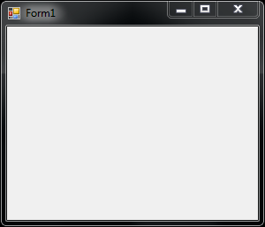
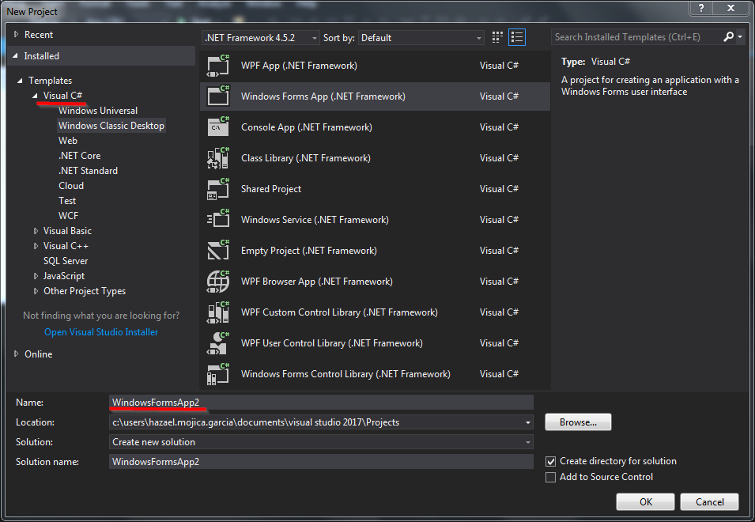
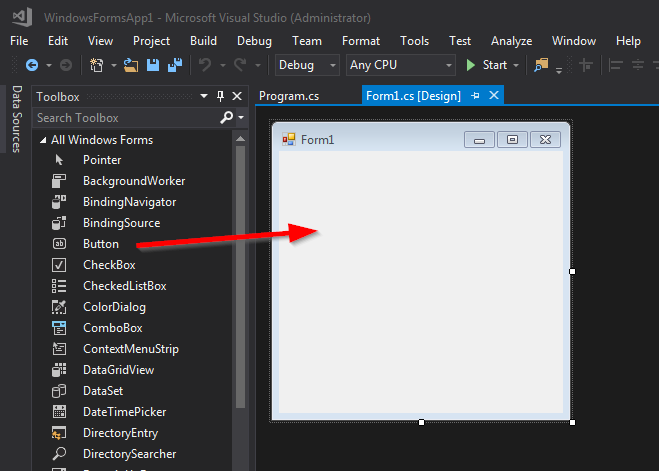
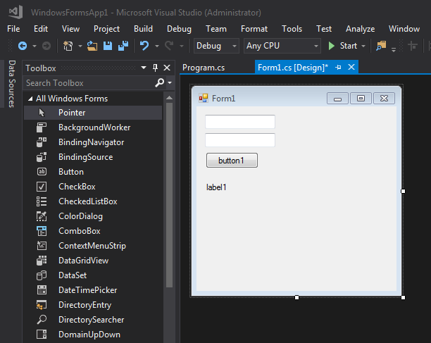
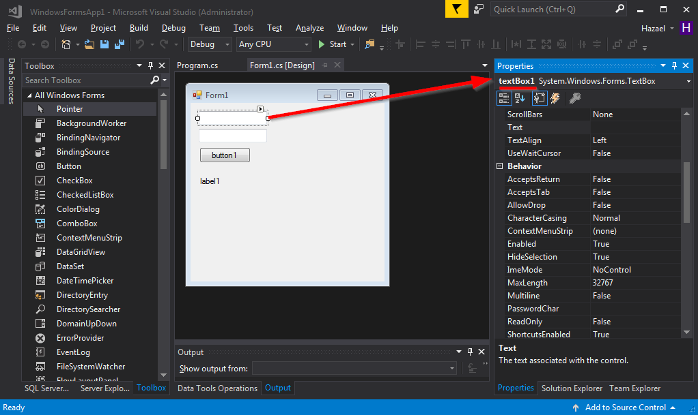
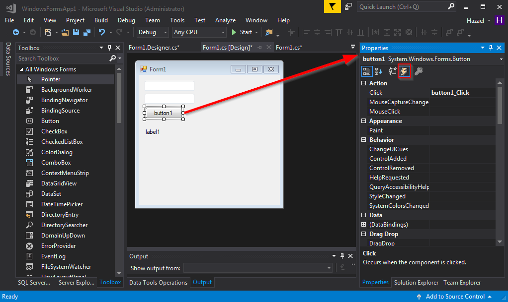
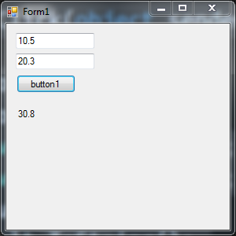
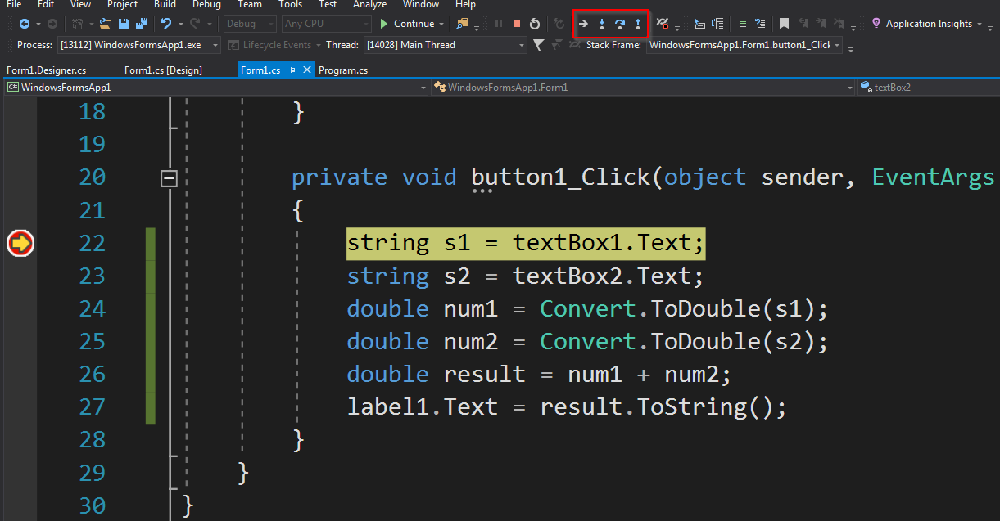
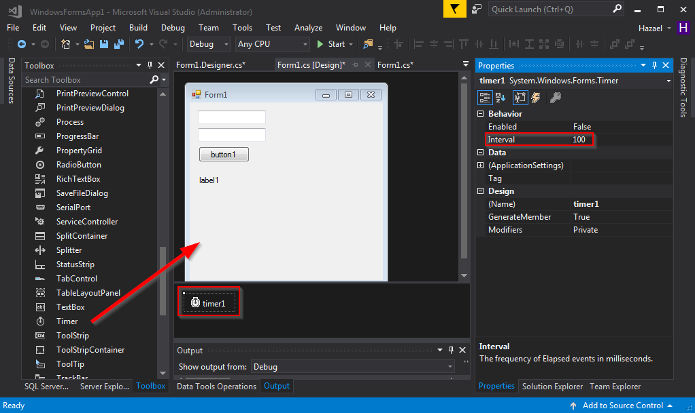

1. Background Knowledge and Prerequisites
1. Windows Forms Overview
1. Creating a new Windows Forms Project
1. Adding Controls
1. Changing properties and appearance
1. Event Handlers
1. User Input
1. Debugging the code
1. The Timer Class


## 1 Background Knowledge and Prerequisites 

In order to follow up this course you will need some background knowledge, mainly basic  programming skills and at least some experience in C#.

> C# is a language for professional programming. C# (pronounced C sharp) is a programming language designed for building a wide range of enterprise applications that run on the .NET Framework.
> The goal of C# is to provide a simple, safe, modern, object-oriented, highperformance , robust and durable language for .NET development.
> Also it enables developers to build solutions for the broadest range of clients, including Web applications, Microsoft Windows Forms-based applications, and thin- and smart-client devices.
>
> [C# Tutorial and source code](http://csharp.net-informations.com/)

I strongly suggest reading and doing the examples in the next web pages **(and if you are one of my students, then it's a must because you will need to answer a quiz about it)**:

1. [C# console based application](http://csharp.net-informations.com/overview/csharp-console-application.htm)
1. [How to use C# if else statements](http://csharp.net-informations.com/statements/csharp-if-else.htm)
1. [How to use C# for loop](http://csharp.net-informations.com/statements/csharp-for-loop.htm)
1. [How to use C# foreach loop](http://csharp.net-informations.com/statements/csharp-foreach-loop.htm)
1. [How to use C# while loop](http://csharp.net-informations.com/statements/csharp-while-loop.htm)
1. [How to use C# switch case statements](http://csharp.net-informations.com/statements/csharp-switch-case.htm)
1. Read just a little of Object Oriented Programming, you won't need to fully understanding for the scope of this course but it can turn useful someday [Object-Oriented Programming](https://docs.microsoft.com/en-us/dotnet/articles/csharp/programming-guide/concepts/object-oriented-programming)

The software you need to have installed so far must be any version of Visual Studio IDE, I recommend the community version of latest Visual Studio: [Visual Studio Community 2017](https://www.visualstudio.com/thank-you-downloading-visual-studio/?sku=Community&rel=15)

## 2 Windows Forms Overview

> With Windows Forms you develop smart clients. Smart clients are graphically rich applications that are easy to deploy and update, can work when they are connected to or disconnected from the Internet, and can access resources on the local computer in a more secure manner than traditional Windows-based applications.
>
> [Windows Forms Overview](https://msdn.microsoft.com/en-us/library/8bxxy49h(v=vs.110).aspx)

### Common Terminology

In order for you to understand more about "what is" and "how to use" Windows Forms you need to know some common vocabulary, tools and classes in the .Net Framework.

* **Classes**
* **Controls**
* **Forms** 

A **Class** in Object Oriented programming is some sort of template where the programmer can encapsulate data in the form of variables and logic in the form of methods. An object is said to be instanciated/created from a a class (template).

Every **Control** in Windows Form is a class and as a class it inherits logic and data from other specialized form of classes. For example a **Form** class (you can image a "Form" as a window object) inherits its properties from the class **ContainerControl** and in turn it inherits from the **ScrollableControl** class.

>In your code, a control class acts the same as any other class. You can create an instance of it, set its properties, and use its methods. The difference is in the lineage. Every Windows control inherits from System.Windows.Forms.Control, and acquires some basic functionality that allows it to paint itself on a window. In fact, even the window that hosts the control inherits from the Control base class.
>
>On its own, a control object doesn’t do much. The magic happens when it interacts with
the Windows Forms engine. The Windows Forms engine handles the Windows operating system messages that change focus or activate a window, and tells controls to paint themselves
by calling their methods and setting their properties. The interesting thing is that although these tasks are performed automatically, they aren’t really hidden from you. If you want, you can override methods and fiddle with the low-level details of the controls. You can even tell them to output entirely different content.
>
>Pro .Net 2.0 Windows Forms and Custom Controls in C# P.9

A **Form** is a class that represents a window, when this class is launched by the main program it creates a new window, like the one below:



You can put as many controls in this window as you like. The controls can be buttons, text, images, charts, menus etc...

## 3 Creating a new Windows Forms Project

1. Open Visual Studio
2. File -> New -> Project
3. Be sure you are under the Visual C# section
4. Click on Windows Classic Desktop
5. Choose Windows Forms App
6. Write a nice name for your first Windows Forms Project
7. Click Ok
8. You will see the Windows Forms Designer with what looks like the draw of a window on it, click the green Start button and see how it comes to live!




That's it, you did it, you have created your first Window Forms application, congrats!!

## 4 Adding Controls

Now let's add some controls because without them this window looks so empty and sad.

Look for a vertical bar called **Toolbox**, if it's not open you can open it going to the Menu View -> Toolbox pr pressing Ctrl+Alt+X.

You can add controls to your From by just dragging and dropping them from the Toolbox Bar to the Form.



Just for the purpose of this example add two TextBox controls, one Button and one Label control as you can see in the next Image.



Start the application and play with the new window you just created, put some text in those TextBoxes and click that nice Button you have there, it won't do anything for now, but we are just warming up, we will add some logic next.

## 5 Changing properties and appearance

Changing the appearance of your controls of your Windows Forms application is easy using Visual Studio.

There's something in the .Net languages called "Propertie". A propertie is just a way to access the internal variables (fields) to set a value on them or to recover it. In the Java world you would call them getters and setters.

The appearance of your controls is stored in those internal variables and you can change them using the Properties of the controls, these Properties vary according to the type of control you want to change but the most common are: BackColor, BackGroundImage, ForeColor, Text, Size, Enabled...

In order to have access to those properties from the Design view **simple right** click any control you want to change and select the **Properties** option, a lateral bar should open showing you all the properties you control has.



There you can play with the properties of your controls, for example you can resize them or change the background color for something you are more alike.

## 6 Event Handlers

Let's pass at how we can handle how the user interacts with our interface, lets discuss **Event Handlers**:

> An event handler is a procedure in your code that determines what actions are performed when an event occurs, such as when the user clicks a button or a message queue receives a message. When an event is raised, the event handler or handlers that receive the event are executed. Events can be assigned to multiple handlers, and the methods that handle particular events can be changed dynamically. You can also use the Windows Forms Designer to create event handlers.
>
>[Creating Event Handlers in Windows Forms](https://msdn.microsoft.com/en-us/library/dacysss4(v=vs.110).aspx)

So, as you can see and **Event** is an action performed by a user, an action like clicking a button, type something in the keyboard, drag and drop items to the window and so on...

The Windows Forms application we are trying to build here is an Event-Driven application:

> An event is an action which you can respond to, or "handle," in code. Events can be generated by a user action, such as clicking the mouse or pressing a key; by program code; or by the system.
> Event-driven applications execute code in response to an event. Each form and control exposes a predefined set of events that you can program against. If one of these events occurs and there is code in the associated event handler, that code is invoked.
> The types of events raised by an object vary, but many types are common to most controls. For example, most objects will handle a Click event. If a user clicks a form, code in the form's Click event handler is executed.
>
> [Events Overview](https://msdn.microsoft.com/en-us/library/1h12f09z(v=vs.110).aspx)

With that said let's try to create some Event handlers to handle the action of a user clicking a button.

In order to do that, in the **Design view** of your Form **make double click** to the button, that will take you to a Code Window where you will see the delegate function that will handle the user interaction.

That function must look like:

```javascript
private void button1_Click(object sender, EventArgs e) {
    //PUT YOUR CODE HERE
}
```

And all the code you put inside those brackets will be executed at the click event of that button.

Another way to create that Event is by going to the **Properties** window, click that little bolt symbol and then double click in the type of event you want to create.




## 7 User Input

Let's try doing something when the user presses that button, for instance we already have enough controls to perform something useful, like a basic calculator. The user of this small application should write two numbers (`num1` and `num2`) one on each TextBox, click the Button and see the result in the Label, that result will be equal to `num1 + num2`.

Let's take the user input as string, tranform it to the rigt type of variables, perform the operation and show the result with the next code:

```javascript
private void button1_Click(object sender, EventArgs e)
{
    string s1 = textBox1.Text;
    string s2 = textBox2.Text;
    double num1 = Convert.ToDouble(s1);
    double num2 = Convert.ToDouble(s2);
    double result = num1 + num2;
    label1.Text = result.ToString();
}
```

Try this little snippet of code running your new Program and make some sums, you should end up with something like this:



## 8 Debugging the code

It doesn't matter how good you are programming, is almost a fact that you will end up with bugs in your code, with that said, is important to know how to debug your code using the amazing Visual Studio IDE to do so.

First, let's put a **Breakpoint** in the first line of our Event method, run your code and wath how all the execution stops in that line when you click the button.
Now, using the **Step Over** Button execute line per line your code and explore the variables content, that could make you realize what's wrong with the program.




## 9 The Timer Class

There's a class that could be useful when programming with embedded devices, let's say you want to launch an Event that runs some code each 10ms just to read the Serial Port where your Arduino card is connected, what you need then is the Timer class.

The **Timer** is a specialized class that you can add to your Windows Form application and depending on the Properties you set on it this class will launch an Event called **Tick**, inside the Tick event you can put some code to do anything you want to accomplish, just take care that the time of execution of that code doesn't exceed the **Interval** time.




## References
* [Getting Started with Windows Forms](https://msdn.microsoft.com/en-us/library/ms229601(v=vs.110).aspx)
* [C# Windows Forms](http://csharp.net-informations.com/gui/cs_forms.htm)
* [Form Class](https://msdn.microsoft.com/en-us/library/system.windows.forms.form(v=vs.110).aspx)