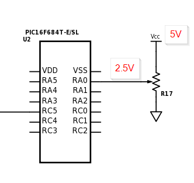
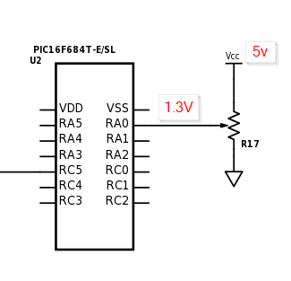
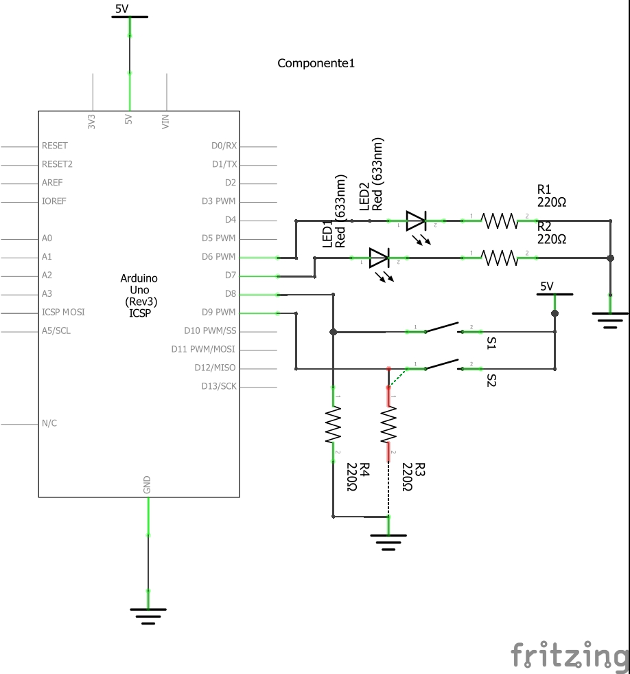
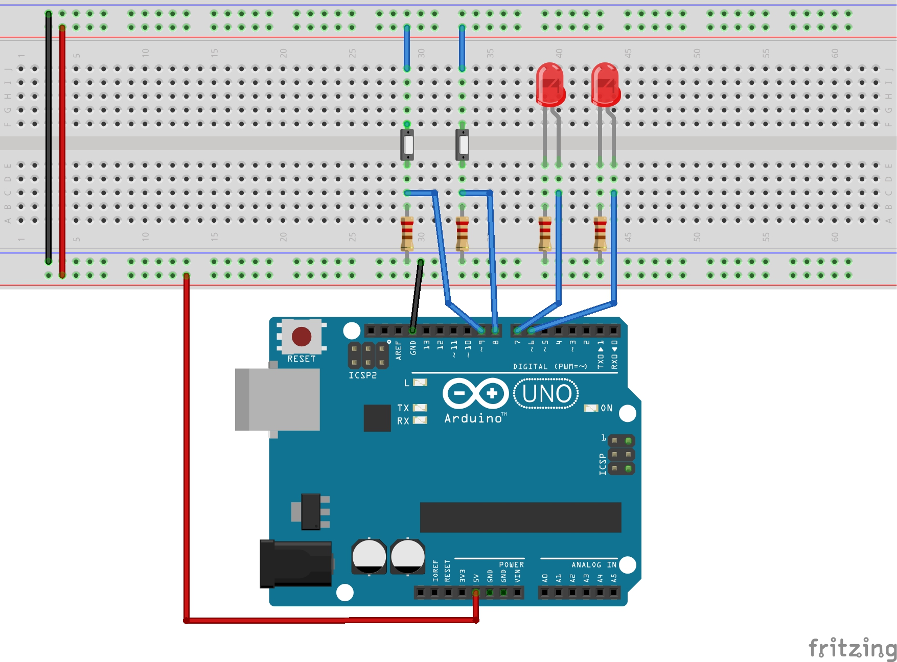
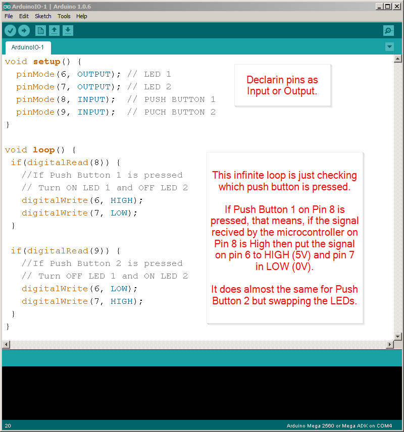

** Lecture Video **

[](http://www.youtube.com/watch?v=)

1. Background Knowledge and Prerequisites
1. The Arduino Board
1. Basic Inputs and Outputs
1. Arduino IO
1. The Serial Port
1. Sending Commands using the Serial Monitor
1. Advanced Topic Sending a stream of commands and values to the Arduino

## Background Knowledge and Prerequisites
I'm assuming you are already familiar at least with the basics of microcontrollers and electronics. If not I strongly suggest you to take the time and follow this tutorials **(and if you are one of my students, then it's a must)**. Feel free to skip information you are already familiar with:

1. [Introduction to Microcontrollers](  https://ti.tuwien.ac.at/ecs/teaching/courses/mclu/theory-material/Microcontroller.pdf) Chapter 2. Microcontroller Components. Pages 11 to 72.
1. [C Tutorial](http://www.cprogramming.com/tutorial/c-tutorial.html)
1. [Installing Arduino on a Windows Machine](https://www.arduino.cc/en/Guide/Windows)
1. [What's an Arduino](https://www.arduino.cc/en/Guide/Introduction)
1. [Bare Minimum code needed](https://www.arduino.cc/en/Tutorial/BareMinimum)
1. [Blink a LED](https://www.arduino.cc/en/Tutorial/Blink)
1. [Using a PushButton](https://www.arduino.cc/en/Tutorial/Button)
1. [Digital Read Serial](https://www.arduino.cc/en/Tutorial/DigitalReadSerial)
1. [Read Analog Voltage](https://www.arduino.cc/en/Tutorial/ReadAnalogVoltage)

## The Arduino Board

So what's and Arduino Board

> Arduino is an open-source electronics platform based on easy-to-use hardware and software. Arduino boards are able to read inputs - light on a sensor, a finger on a button, or a Twitter message - and turn it into an output - activating a motor, turning on an LED, publishing something online. You can tell your board what to do by sending a set of instructions to the microcontroller on the board. To do so you use the Arduino programming language (based on Wiring), and the Arduino Software (IDE), based on Processing.
>
>[Arduino Intro](https://www.arduino.cc/en/Guide/Introduction)

In other words, an Arduino board is a **microcontroller** with a bunch of other **useful components** attached to it, these components allow you to easily prototype and test new ideas with few lines of code an the bare minimum extra hardware.

I dare to say that Arduino may be very famous for students but it is a tabu in the industry. Experienced engineers undervalue the power of an Arduino saying it's merely a toy. In my personal opinion an Arduino is a perfectly capable developing board for prototyping and experiments and you can even use it in real final products with some tweaks, although coding in the Arduino Programming Language is not scalable nor maintainable you can always use pure C or any other language supported by AVR.

We use an **Arduino** for this course because we don't care about complicated hardware, performance or code scalaility, we are concerned only with the basics of the Serial communication and how to design an easy to use intuitive GUI.

## Basic Inputs and Outputs

Microcontrollers are used because they allow a piece of hardware to interact with it's environment "easily".

Imagine you want to build a "robot" (just imagine it...), you want this robot to be aware of it's environment, what I mean with this is that you want this robot to "see", "hear", "smell" and "feel" everything around it.
You may want also to make this robot interact with the environment, you may want it to "walk" or at least "move" and avoid obstacles, or maybe you want to speak an order and make the robot obey, for example saying "make me a sandwich" will make the robot go to the fridge, fetch the ingredients and start making you a damn sandwich!!

Well that wasn't very realistic right now, but a microcontroller can help you retrieving signals from the environment and control actuators in order to make your little wall-e behave decently.

The environment signals the microcontroller retrieve are the inputs, and logically, the signals sent to the actuators are the outputs.

**So, how exactly the IO of a microcontroller works?**

> Digital I/O, or, to be more general, the ability to directly monitor and control hardware, is the main characteristic of microcontrollers. As a consequence, practically all microcontrollers have at least 1-2 digital I/O pins that can be directly connected to hardware (within the electrical limits of the controller). In general, you can find 8-32 pins on most controllers, and some even have a lot more than that (like Motorola’s HCS12 with over 90 I/O pins).
> I/O pins are generally grouped into ports of 8 pins, which can be accessed with a single byte access. Pins can either be input only, output only, or —most commonly,— bidirectional, that is, capable of both input and output.
>
> [Introduction to Microcontrollers p.39](  https://ti.tuwien.ac.at/ecs/teaching/courses/mclu/theory-material/Microcontroller.pdf)

A microcontroller like any processor works by moving around bytes in the memory, so there's a memory assigned to each Port, wether it's input or ouput you can use this memory to **read** or **write** values that reflects what's physically in the real world.

### Digital IO

Let's see an example, in the next Image we have an Atmega microcontroller connected to some components.


The Port E (All pins called PEx) is connected to LEDs and the Port C is connected to a DIP Switch (just an array of buttons/switches). We are going to assume here that we have declared the **PORT E as output** and the **PORT C as inpu**t (for obvious reasons).

So what should we do if we want to turn on all those LEDs? We will need to assign to the memory **PORT_E** a value equal to the binary number **11111111b** (xFF or 255).
Why? Imagine each Pin of the port mapped to each one of the digits of that binary number, so in order to turn them all on we need to set them all to one.

```javascript
PORT_E = 11111111b; //You can use binary numbers
PORT_E = 255;       //Decimal
PORT_E = xFF;       //Or Hexadecimal
```
That will result in all the LEDs turned on:


So if you want to just turn on the half of them, let's say from pin 0 to pin 3 do:

```javascript
PORT_E = 00001111b; //You can use binary numbers
PORT_E = 15;       //Decimal
PORT_E = xF;       //Or Hexadecimal
```


Or alternated

```javascript
PORT_E = 1010101b; //You can use binary numbers
PORT_E = 85;       //Decimal
PORT_E = x55;      //Or Hexadecimal
```


This same thing applies for the **Input**, so imagine you turn on the switches 0, 3 and 7. This will result in **PORT_C** having a value of 10001001b which is 137 in decimal or x89 in hexadecimal.


### Analog IO

Now what to do if the input you want to read is not digital (It's value is not 1 or 0, 5v or 0v...) but analog?

Then you need an **Analog to Digital Converter**, hopefully most microcontrollers have at least one built-in. I won't explain the details about how a ADC works, instead I just want you to know the practical approach.

Most of Analog pins are noted as ANx, in the next datasheet you can find that the pin 13 can be used as Digital (RA0) or Analog (AN0).


If we had a circuit like the one below with just a voltage divider (using a potenciometer) connected directly to the AN0 pin and everything is configured correctly  we would be able to read analog values.


In our program an analog value will be represented as a number, this number will obey the next formula for a *10bits* resolution ADC

```javascript
analog_val = V_input * 1024 / VCC
```

So for example, if we move the potenciometer to a position in which it throws an output of **2.5v** then the ADC in your program will read **512**. And for **1.3v** will read **266**.





**NOTE:** This formula only applies if you have NOT connected the analog reference pin of the microcontroller to a different source of voltage. If you have, then just replace the VCC for your new RefVoltage. You would have something like `analog_val = V_input * 1024 / RefVoltage`.

### PWM

Most decent microcontrollers have a **PWM** pin. PWM stands for **Pulse Width Modulation** and its widely used along microcontrollers to produce a wave very much alike to a square wave.

> Pulse Width Modulation, or PWM, is a technique for getting analog results with digital means. Digital control is used to create a square wave, a signal switched between on and off. This on-off pattern can simulate voltages in between full on (5 Volts) and off (0 Volts) by changing the portion of the time the signal spends on versus the time that the signal spends off. The duration of "on time" is called the pulse width. To get varying analog values, you change, or modulate, that pulse width. If you repeat this on-off pattern fast enough with an LED for example, the result is as if the signal is a steady voltage between 0 and 5v controlling the brightness of the LED.
>
> [Arduino PWM](https://www.arduino.cc/en/Tutorial/PWM)

One key word here is **Duty Cycle** or DC, the DC is measured in percentage of time the wave is in High State, for the particular case of an Arduino this Duty Cycle is defined as a number of 8bits (0 - 255).

In the next image you can see different PWM wave forms with different Duty Cycles, where a DC of 0 is basically 0v all the time and a DC of 50% (defined by the number 127) will keep a the signal on High state half the time.


> PWM signals are useful for a lot of things. Apart from their uses in simple d/a converters they can be used to implement ABS in cars, to dim LEDs or numeric displays, or for motor control (servos, stepper motors, speed control of dc motors).
>
> [Introduction to Microcontrollers p.71](  https://ti.tuwien.ac.at/ecs/teaching/courses/mclu/theory-material/Microcontroller.pdf)


## Arduino IO

I'll use an [Arduino UNO](https://www.arduino.cc/en/Main/ArduinoBoardUno) which uses an **ATmega328P** as an example for Inputs and Outputs.

In the next image there's a typical Arduino UNO board.


Here is how the pins of the microcontroller (Atmega168) are mapped to the board terminals, remember that the number printed in front of the Terminal/Header could not be the same as the Pin Number in the Atmega328, the creators of Arduino have abstracted the real pin numbers in order for you to be easy to program an Arduino Board and to make Portable all the code between different models.

This image was extracted from [here](https://www.arduino.cc/en/Hacking/PinMapping168). If you want to see the full schematic visit: [link](https://www.arduino.cc/en/uploads/Main/Arduino_Uno_Rev3-schematic.pdf).


So, how do we use an Arduino to control inputs and outputs? Just one answer: Very easy! Lets think you have the next diagram:



And if you feel inspired and you want to build it, here is how it would look like in a Protoboard:



The goal is to press the Push Buttons and make the LEDs Turn On in a fashion way. So when you press Push 1 LED1 will turn on and LED2 will turn off. When you press Push 2 the LEDs will swap that state, LED1 will turn Off and LED2 will turn on.

This is the code to do that:



```javascript
/*
  Hazael Fernando Mojica Garcia
  09/July/2017
  Example: HMI-2-ArduinoIO-Simple
*/
void setup() {
  pinMode(6, OUTPUT); // LED 1
  pinMode(7, OUTPUT); // LED 2
  pinMode(8, INPUT);  // PUSH BUTTON 1
  pinMode(9, INPUT);  // PUSH BUTTON 2
}

void loop() {
 if(digitalRead(8)) {
   //If Push Button 1 is pressed
   // Turn ON LED 1 and OFF LED 2
   digitalWrite(6, HIGH);
   digitalWrite(7, LOW);
 }
 
 if(digitalRead(9)) {
   //If Push Button 2 is pressed
   // Turn OFF LED 1 and ON LED 2
   digitalWrite(6, LOW);
   digitalWrite(7, HIGH);
 }
}
```

Take note that we are using very few code and there are some special functions you will be using very often:

* `pinMode(pinNumber, MODE);` To declare a pin as INPUT or OUTPUT. [Ref Here](https://www.arduino.cc/en/Reference/pinMode).
* `digitalWrite(pinNumber, STATE);` To make a pin have HIGH or LOW output signal. [Ref Here](https://www.arduino.cc/en/Reference/DigitalWrite).
* `digitalRead(pinNumber)` Reads the value of a pin. Which could be HIGH (1) or LOW (0). [Ref Here](https://www.arduino.cc/en/Reference/DigitalRead).

All these functions as you may have notice control the state of a single pin not the whole port, this is a peculiarity of Arduino, the Arduino compiler handles for you the boiler plate code to make reference a single pin instead of a complete port in order for you to easily use it. This is good or bad depending of what you need to accomplish.

Feel free to implement the next examples if you think you need some more practice in order to understand the basics of Arduino IO:

* [Arduino Button](https://www.arduino.cc/en/Tutorial/Button)
* [Arduino State Change Detection](https://www.arduino.cc/en/Tutorial/StateChangeDetection)
* [Arduino Blink Without Delay](https://www.arduino.cc/en/Tutorial/BlinkWithoutDelay)
* [Arduino Analog Input](https://www.arduino.cc/en/Tutorial/AnalogInput)
* [Arduino Debounce](https://www.arduino.cc/en/Tutorial/Debounce)


### Example: Using multiple input/outputs
Now let's see a practical example using many inputs and outputs.

The goals of this example are: 
* control the movement of a Servo motor using a potentiometer. When the pot is set to give an output of 0V the degrees advanced in the servo will be 0° and when the pot output is 5V the servo will advance the full length of 180°.
* Control the blinking interval of a LED using a push button. Each time the user presses the push button the LED will blink faster, starting from a 1sec period and up to a 10ms period.

The protoboard view is in this picture


And the schematic is:


The Arduino Code is:

```javascript
/*
  Hazael Fernando Mojica Garcia
  09/July/2017
  Example: HMI-2-ArduinoIO-Multi
*/

int pinServo = 3;
int pinLED = 4;
int pinPush = 5;
int pinPotA = 0;
int LEDState = 0;

unsigned int intervalLED = 1000;
unsigned int intervalPush = 500;
unsigned int intervalServo = 100;

unsigned long pastMillisLED = 0;
unsigned long pastMillisServo = 0;
unsigned long pastMillisPush = 0;

unsigned long currentMillis = 0;

void setup() {
  pinMode(pinServo, OUTPUT);//PWM pin as output
  pinMode(pinLED, OUTPUT);
  pinMode(pinPush, INPUT);
}

void loop() {
  currentMillis = millis();
  
  if((currentMillis - pastMillisLED) >= intervalLED) {
    //This block will be executed each intervalLED ms
    blinkLED();
    pastMillisLED = currentMillis;
  }
  
  if((currentMillis - pastMillisServo) >= intervalServo) {
    //This block will be executed each intervalServo ms
    moveServo();
    intervalServo = currentMillis;
  }
  
  if((currentMillis - pastMillisPush) >= intervalPush) {
    //This block will be executed each intervalPush ms
    changeBlinkInterval();
    intervalPush = currentMillis;
  }
}

void blinkLED() {
  LEDState = 1 - LEDState;//Swap LED state
  digitalWrite(pinLED, LEDState);//Blink LED
}

void moveServo() {
  int potVal = analogRead(pinPotA);//potVal from 0 to 1023
  analogWrite(pinServo, potVal/4);//Output PWM from 0 to 255 
}

void changeBlinkInterval() {
  if(digitalRead(pinPush)) {
    intervalLED -= 100;//Decrease 100ms
    if(intervalLED <= 100) {
      intervalLED = 1000; //Reset the Interval
    }
  }
}
```

Mount everything in your Arduino and try it out.

**Code Explained:**

This code structure is based in time invervals, we want to be able to execute some code periodically, we don't want it to run everytime the main loop comes back again, that would be disastrous setting up the PWM for a Servo, we don't want to use delay functions either because it's a waste of processing resources and once the micro enters in a delay it cannot do anything else until it's done.

What do we do then? In embedded software you normally would use a RTOS (Real Time Operative System) or Interruptions, the creators of Arduino actually use both inside Arduino's kernel code, but they decided not to let us touch them, instead they provide us with a function called `millis()`, this function returns an `unsigned long` number which represents the milliseconds elapsed since the arduino was turned on. So, using a clever `if statement` we can build some sort of task manager:

```javascript
if((currentMillisecond - pastMilliseconds) >= interval) {
    //This code will be executed each interval milliseconds
    pastMilliseconds = currentMillisecond;
}
```

In the code above all variables represent milliseconds values, remember to use only `unsigned long` variables for this kind of work.

    
## The Serial Port

### What's a Serial Port

### The signal

### Serial Communication in the Industry


## Sending Commands to Arduino via Serial using the Serial Monitor

### Example: Turn On/Off via Serial

### Example: Controlling multiple input/output's via Serial


## Advanced Topic Sending a stream of commands and values to the Arduino

### Example: Controlling multiple input/output's via Serial using a stream of commands