** Lecture Video **

[](http://www.youtube.com/watch?v=)

1. Overview
1. Assembling the Arduino Board
1. Example 1: Basic command based communication
1. Example 2: Extending functionality using a Timer

Aquí lo único que va se hará es una sencilla comunicación con el Arduino.
El Arduino tendrá 2 push, 1 pot, 2 leds (no para on/off y otro para PWM).

La GUI será lo más básica posible sin usar un stream de comandos hacia el Arduino.
El PWM se controlará por medio de pasos: 'a' para PWM 25%, 'b' PWM 50% y así...

## Overview
In this lecture we will communicate the prototype board we assembled in the previous lecture with a software made in .Net Framework.

We will code a new Windows Forms application that will communicate over the Serial Port with an Arduino Board which has some components attached to it: Servo motor, potenciometer, push button, LED.

We will basically replace the Serial Monitor with a "custom" program that will send the commands to the arduino. This way we will create a nice Graphic User Interface (GUI) that an average person will be able to easily use.

## Assembling the Arduino Board
You should already have the Arduino Board assembled from the past lecture.
Anyway here I post the hardware again:

The protoboard view is in this picture


And the schematic is
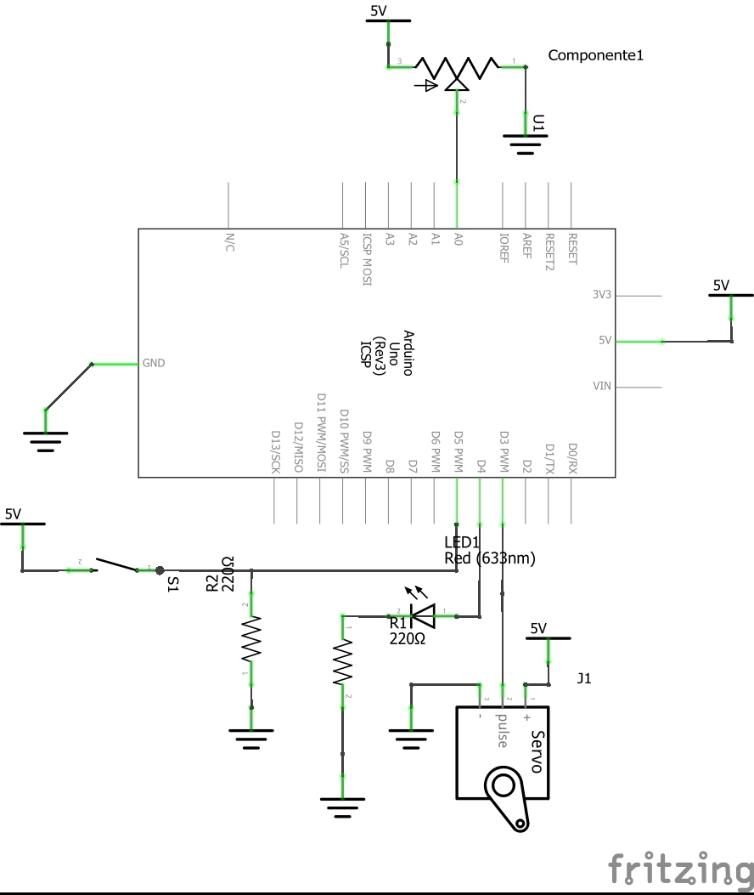

## Example 1: Basic command based communication

The next example is about controlling an Arduino Board using a GUI build using the Windows Forms libraries from the .Net 4.5 Framework.

You can find Arduino code and the complete project in GitHub:
[https://github.com/hmojicag/hmojicag-hmi-examples/tree/master/HMI3-Ex1](https://github.com/hmojicag/hmojicag-hmi-examples/tree/master/HMI3-Ex1)

### Coding Arduino commands
So keep in mind that the commands that the Arduino will receive will be sent over the Serial Port for a program having a GUI. The GUI will have buttons, checkboxes and text boxes, the common controls any person so far is used to see in any application.

I'll use the same code from the last lecture's example "Example: Controlling multiple input/output’s via Serial" with little modifications:

```javascript
/*
* Hazael Fernando Mojica García
* 11/August/2017
* HMI-3-Arduino-.Net-Ex1
*/

int pinServo = 3;
int pinLED = 4;
int pinPush = 5;
int pinPotA = 0;

int pwmVal = 0;

void setup() {
  Serial.begin(115200);
  pinMode(pinServo, OUTPUT);
  pinMode(pinLED, OUTPUT);
  pinMode(pinPush, INPUT);
}

void loop() {
  if(Serial.available()) {
    switch(Serial.read()) {
      case 'a'://Turn On LED
        digitalWrite(pinLED, HIGH);
      break;
      
      case 'b'://Turn Off LED
        digitalWrite(pinLED, LOW);
      break;
      
      case 'c'://Increase servo PWM
        increaseServo();
      break;
      
      case 'd'://Decrease servo PWM
        decreaseServo();
      break;

      case 'e'://Read Digital Val
        readDigitalVal();
      break;

      case 'f'://Read Analog Value
        readAnalogVal();
      break;
    }
  }
}

void increaseServo() {
  pwmVal += 5;
  if(pwmVal > 255) {
    pwmVal = 255;
  }
  setPWMVal();
}

void decreaseServo() {
  pwmVal -= 5;
  if(pwmVal < 0) {
    pwmVal = 0;
  }
  setPWMVal();
}

void setPWMVal() {
  analogWrite(pinServo, pwmVal);
}

void readDigitalVal() {
  //Writes "HIGH\r\n" if Push is pressed
  //writes "LOW\r\n" otherwise
  if(digitalRead(pinPush)) {
    Serial.println("HIGH");
  } else {
    Serial.println("LOW");
  }
}

void readAnalogVal() {
  //Write a String of values representing a number
  //between 0 and 1023 and adds \r\n at the end
  //Example: "0\r\n", "20\r\n", "341\r\n", "1023\r\n",
  //https://www.arduino.cc/en/Serial/Println
  Serial.println(analogRead(pinPotA));
}
```

### Designing the GUI and coding the .Net Application

Create a new Windows Forms project in Visual Studio and add **6 buttons and 2 Labels**.
If you don't remember Windows Forms or Visual Studio read again [HMI-1 C# .Net Fundamentals using Windows Forms]({{ site.baseurl }})
You will end up with something similar to the next image:

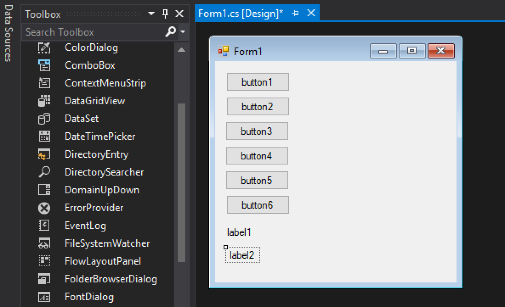

Arrange everything and put text in the buttons so each one of them sends a specific command to the Arduino.
The next image is the final view of or screen.

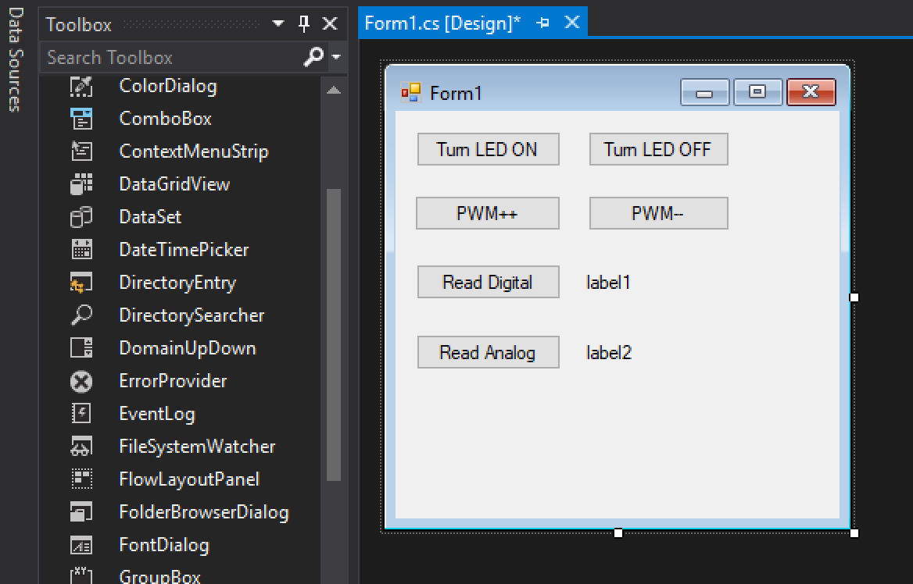

I renamed the Control variable names so they coincide with the function they do, instead of having the default names like button1, button2, label1 and so forth, I'll have button_LEDOn, button_LEDOff, label_Digital. You can do the same by changing the Property **(name)** in the Properties panel.

Create the click events for each one of the buttons and declare a SerialPort instance variable for handling the SerialPort communication, this variable needs to be initialized in the Forms constructor with the correct Baud Rate (115200 bds) and the COM port name.

You can find the port name in the Arduino IDE or in the Device Manager:

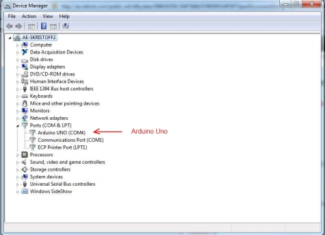

You would end up with the next code:

```javascript
using System;
using System.Windows.Forms;
using System.IO.Ports;

namespace HMI3_Ex1
{
    public partial class Form1 : Form
    {
        private SerialPort serialPort;
        public Form1()
        {
            InitializeComponent();
            //Actually creates the Serial Port instance object
            //The Arduino is in COM1 and uses a Baud Rate of 115200bds
            serialPort = new SerialPort("COM1", 115200);
            serialPort.Open();
        }

        private void button_LEDOn_Click(object sender, EventArgs e)
        {
            serialPort.Write("a");
        }

        private void button_LEDOff_Click(object sender, EventArgs e)
        {
            serialPort.Write("b");
        }

        private void button_PWMInc_Click(object sender, EventArgs e)
        {
            serialPort.Write("c");
        }

        private void button_PWMDec_Click(object sender, EventArgs e)
        {
            serialPort.Write("d");
        }

        private void button_Digital_Click(object sender, EventArgs e)
        {
            serialPort.Write("e");
            this.label_Digital.Text = serialPort.ReadLine();
        }

        private void button_Analog_Click(object sender, EventArgs e)
        {
            serialPort.Write("f");
            this.label_Analog.Text = serialPort.ReadLine();
        }

        private void Form1_FormClosing(object sender, FormClosingEventArgs e)
        {
            serialPort.Close();
        }
    }
}
```

### Testing functionality

So we compile and upload the code to the Arduino board, replace the correct Serial Port in the code of the C# GUI, instead of "COM1" you could have "COM2" or "COM3", who knows.

Run the GUI and click en the buttons to see how it works.
Here is an example image of the GUI working:

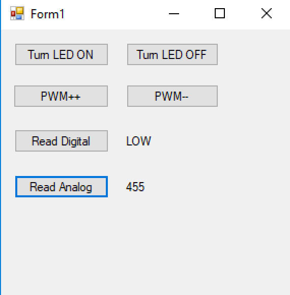

## Example 2: Extending functionality using a Timer

Now, we don't actually want to push the button each time we want to read something from the Serial Port, what about building a program that automatically sends the read command to the arduino in order to get the analog signal value?

You can find the code in GitHub: []()

The code for the Arduino changed slightly, I have only deleted the Digital Read command. For this example the only thing that the PC will receive by the Serial Port is the analog port value, if we try to send two different values, the value from the digital pin and the value from the analog port we won't be able to differenciate one from te other (at least not in the way we are doing it now).

We are going to use a **Timer** object, this timer will send the "f" command periodically in order to get the Analog Port Value from the Arduino. This value is a String object, we will need to convert this String to an Integer (int32) so we can make a nice chart with it.

We will also add 2 buttons, one for starting the Timer and one for stopping it.

It's also worth mentioning that now we are decopling the data transmission from the data reception. With this I mean that when we send a command via Serial Port we are not expecting an inmediate response and this is good because it may not be even one, instead of let our program hang until a response is comming it's better to make a separated process handle it.

### Coding arduino commands

It's almost the same code as in the previous example but without the call for reading a digital value.

```javascript
/*
* Hazael Fernando Mojica García
* 11/August/2017
* HMI-3-Arduino-.Net-Ex2
*/

int pinServo = 3;
int pinLED = 4;
int pinPush = 5;
int pinPotA = 0;

int pwmVal = 0;

void setup() {
  Serial.begin(115200);
  pinMode(pinServo, OUTPUT);
  pinMode(pinLED, OUTPUT);
  pinMode(pinPush, INPUT);
}

void loop() {
  if(Serial.available()) {
    switch(Serial.read()) {
      case 'a'://Turn On LED
        digitalWrite(pinLED, HIGH);
      break;
      
      case 'b'://Turn Off LED
        digitalWrite(pinLED, LOW);
      break;
      
      case 'c'://Increase servo PWM
        increaseServo();
      break;
      
      case 'd'://Decrease servo PWM
        decreaseServo();
      break;

      case 'f'://Read Analog Value
        readAnalogVal();
      break;
    }
  }
}

void increaseServo() {
  pwmVal += 5;
  if(pwmVal > 255) {
    pwmVal = 255;
  }
  setPWMVal();
}

void decreaseServo() {
  pwmVal -= 5;
  if(pwmVal < 0) {
    pwmVal = 0;
  }
  setPWMVal();
}

void setPWMVal() {
  analogWrite(pinServo, pwmVal);
}

void readAnalogVal() {
  //Write a String of values representing a number
  //between 0 and 1023 and adds \r\n at the end
  //Example: "0\r\n", "20\r\n", "341\r\n", "1023\r\n",
  //https://www.arduino.cc/en/Serial/Println
  Serial.println(analogRead(pinPotA));
}
```

### Designing the GUI and coding the .Net Application

You need to delete everything related to the digital read routines.
Add a SerialPort and a Timer controls to the Form.
Also add a Chart control and change it's Series to a **Spline** as shown in the images below:

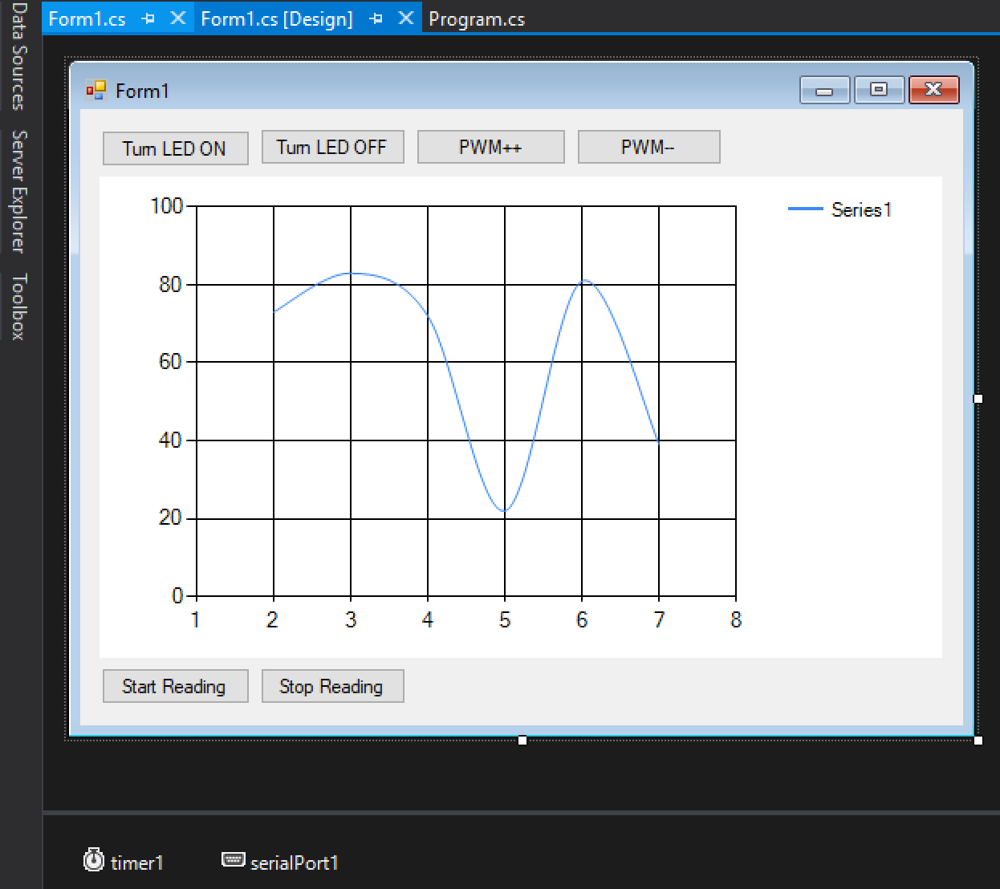

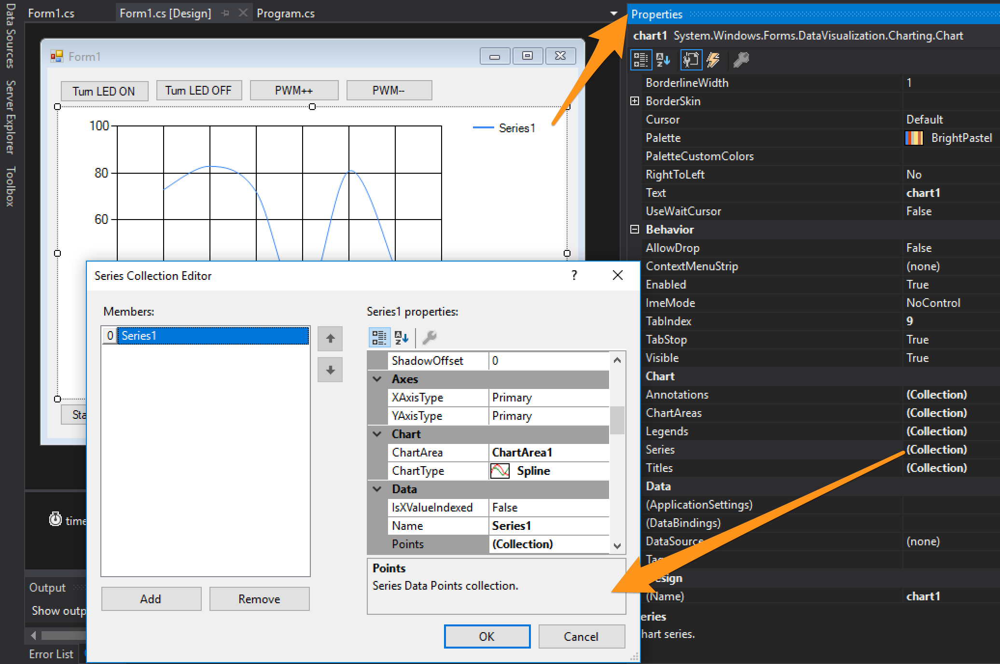

Configure the Timer for an Interval of **300ms** using the Properties panel.

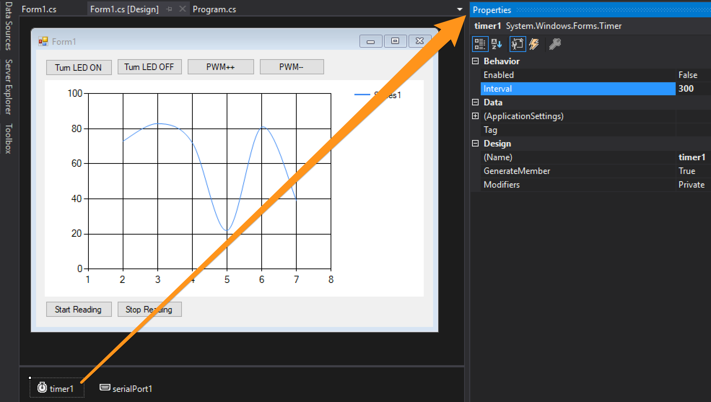

Create a **"Tick Event"** for the Timer control using the Properties panel - Events section  and makind double click to the "Tick" Behavior.

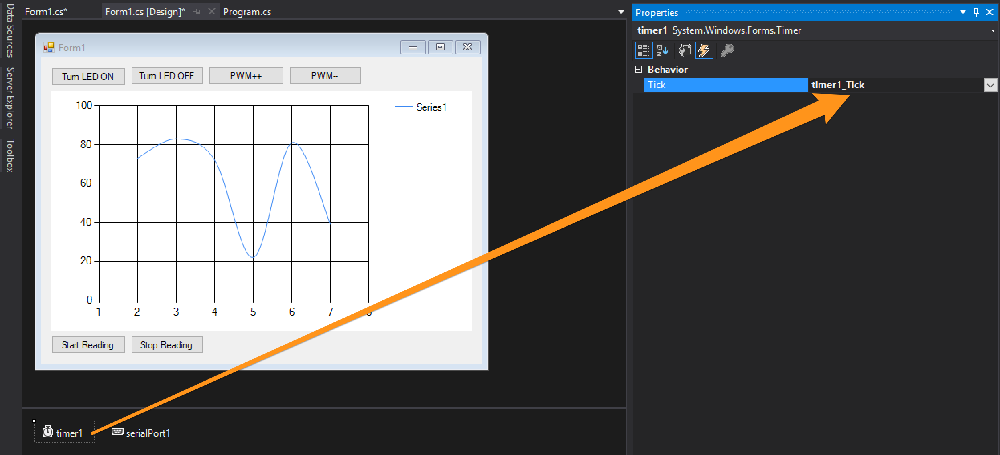

Configure the SerialPort for using the Serial Port "COMx" your Arduino is connected to and a Baud Rate of **115200** using the Properties Panel.

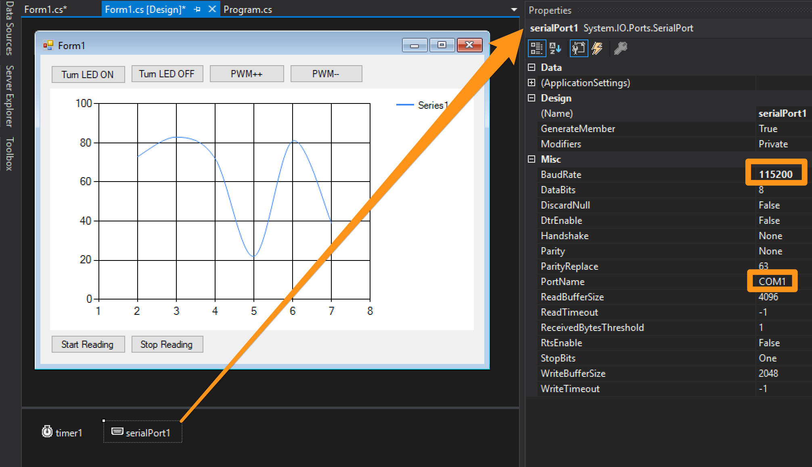

Create a **"Data Received Event"** using the Properties panel - Events section and making double click to the "DataReceived" Behaviour.

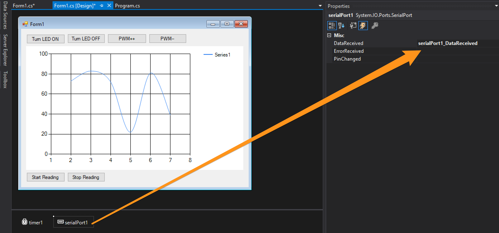

The code would looks like:

```javascript
using System;
using System.Windows.Forms;
using System.IO.Ports;
using System.Collections.Generic;

namespace HMI3_Ex2 {
    public partial class Form1 : Form {
        private Queue<int> samples;
        public Form1() {
            InitializeComponent();
        }

        private void button_LEDOn_Click(object sender, EventArgs e) {
            serialPort1.Write("a");
        }

        private void button_LEDOff_Click(object sender, EventArgs e) {
            serialPort1.Write("b");
        }

        private void button_PWMInc_Click(object sender, EventArgs e) {
            serialPort1.Write("c");
        }

        private void button_PWMDec_Click(object sender, EventArgs e) {
            serialPort1.Write("d");
        }

        private void Form1_FormClosing(object sender, FormClosingEventArgs e) {
            serialPort1.Close();
        }

        private void timer1_Tick(object sender, EventArgs e) {
            if (serialPort1.IsOpen) {
                //Sends 'f' each 300ms
                serialPort1.Write("f");
                ChartRefresh();
            } else {
                //Something is wrong. Close the application.
                timer1.Stop();
                timer1.Enabled = false;
                MessageBox.Show("The Serial Port is not open");
                this.Close();
            }
        }

        private void button_Analog_Start_Click(object sender, EventArgs e) {
            timer1.Enabled = true;
            timer1.Start();
        }

        private void button_Analog_Stop_Click(object sender, EventArgs e) {
            timer1.Stop();
            timer1.Enabled = false;
        }

        private void serialPort1_DataReceived(object sender, SerialDataReceivedEventArgs e) {
            //This method gets called each time data is received over the Serial Port
            SerialPort serialPort = (SerialPort)sender;
            string data = serialPort.ReadLine();
            int analogVal = Convert.ToInt32(data);
            EnqueueSample(analogVal);
        }

        private void Form1_Load(object sender, EventArgs e) {
            samples = new Queue<int>(50);
            serialPort1.Open();
        }

        private void EnqueueSample(int sample) {
            if (samples.Count >= 50) {
                samples.Dequeue();
            }
            samples.Enqueue(sample);
        }

        private void ChartRefresh() {
            chart1.Series[0].Points.Clear();
            foreach(int sample in samples) {
                chart1.Series[0].Points.AddY(sample);
            }
        }
    }
}
```

Paying close attention the this code you should note some differences compared to the previous example:

1. The SerialPort variable is now handled in the Designer view and is now called serialPort1.
1. A new Event is used for get notified when we are receiving data over the Serial Port, which is the method **`serialPort1_DataReceived`**.
1. A method called **`timer1_Tick`** is executed each 300ms and it sends the command "`f`" over the Serial Port, it also has some validation in it to stop the application if for some reason the Serial Port is unavailable.
1. An instance variable `private Queue<int> samples;` is created for storing up to 50 values retrieved from the Analog Digital convertion made by the Arduino. If you don't know this data structure here is some useful links: [Wikipedia](https://en.wikipedia.org/wiki/Queue_(abstract_data_type)), [MSDN](https://msdn.microsoft.com/en-us/library/7977ey2c(v=vs.110).aspx).
1. The method **`ChartRefresh()`** iterates over the Queue of samples and paints the Chart again. Note how this method is called inside the Tick event, this means the Chart is going to have a refresh rate of 300ms.
1. The methods **`button_Analog_Start_Click`** and **`button_Analog_Stop_Click`** are used only for starting and stoping the Tick Event execution.

Other than that everything works as in the previous example.

### Testing functionality

Compile and upload the code to the Arduino.
Run the GUI application, click the Turn LED ON and OFF, the PWM++ and -- buttons to check if they are still working.
And now click the Start Reading button to start populating the SPLine Chart.

Here we have an image showing how the application looks like once you Start Reading the analog input from the Arduino, the Chart is populated with the ADC data coming over the Serial Port.

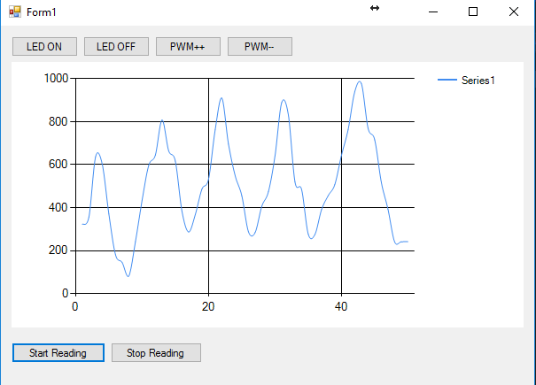