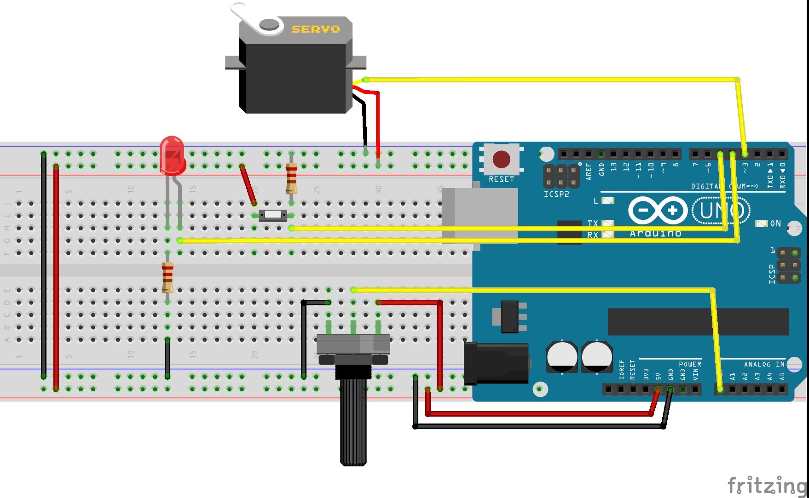

** Lecture Video **

[](http://www.youtube.com/watch?v=)

1. Overview
1. Assembling the Arduino Board
1. Example 1: Basic command based communication
1. Example 2: Extending functionality using a Timer

Aquí lo único que va se hará es una sencilla comunicación con el Arduino.
El Arduino tendrá 2 push, 1 pot, 2 leds (no para on/off y otro para PWM).

La GUI será lo más básica posible sin usar un stream de comandos hacia el Arduino.
El PWM se controlará por medio de pasos: 'a' para PWM 25%, 'b' PWM 50% y así...

## Overview
In this lecture we will communicate the prototype board we assembled in the previous lecture with a software made in .Net Framework.

We will code a new Windows Forms application that will communicate over the Serial Port with an Arduino Board which has some components attached to it: Servo motor, potenciometer, push button, LED.

We will basically replace the Serial Monitor with a "custom" program that will send the commands to the arduino. This way we will create a nice Graphic User Interface (GUI) that an average person will be able to easily use.

## Assembling the Arduino Board
You should already have the Arduino Board assembled from the past lecture.
Anyway here I post the hardware again:

The protoboard view is in this picture


And the schematic is


## Example 1: Basic command based communication

### Coding Arduino commands
So keep in mind that the commands that the Arduino will receive will be sent over the Serial Port for a program having a GUI. The GUI will have buttons, checkboxes and text boxes, the common controls any person so far is used to see in any application.

I'll use the same code from the last lecture's example "Example: Controlling multiple input/output’s via Serial" with little modifications:

```javascript
/*
* Hazael Fernando Mojica García
* 31/July/2017
* HMI-3-Arduino-.Net-1
*/

int pinServo = 3;
int pinLED = 4;
int pinPush = 5;
int pinPotA = 0;

int pwmVal = 0;

void setup() {
  Serial.begin(115200);
  pinMode(pinServo, OUTPUT);
  pinMode(pinLED, OUTPUT);
  pinMode(pinPush, INPUT);
}

void loop() {
  if(Serial.available()) {
    switch(Serial.read()) {
      case 'a'://Turn On LED
        digitalWrite(pinLED, HIGH);
      break;
      
      case 'b'://Turn Off LED
        digitalWrite(pinLED, LOW);
      break;
      
      case 'c'://Increase servo PWM
        increaseServo();
      break;
      
      case 'd'://Decrease servo PWM
        decreaseServo();
      break;

      case 'e'://Read Digital Val
        readDigitalVal();
      break;

      case 'f'://Read Analog Value
        readAnalogVal();
      break;
    }
  }
}

void increaseServo() {
  pwmVal += 5;
  if(pwmVal > 255) {
    pwmVal = 255;
  }
  setPWMVal();
}

void decreaseServo() {
  pwmVal -= 5;
  if(pwmVal < 0) {
    pwmVal = 0;
  }
  setPWMVal();
}

void setPWMVal() {
  analogWrite(pinServo, pwmVal);
  //Write a String of values representing a number
  //between 0 and 255 and adds \r\n at the end
  //Example: "0\r\n", "64\r\n", "128\r\n", "255\r\n"
  Serial.println(pwmVal);
}

void readDigitalVal() {
  //Writes "HIGH\r\n" if Push is pressed
  //writes "LOW\r\n" otherwise
  if(digitalRead(pinPush)) {
    Serial.println("HIGH");
  } else {
    Serial.println("LOW");
  }
}

void readAnalogVal() {
  //Write a String of values representing a number
  //between 0 and 1023 and adds \r\n at the end
  //Example: "0\r\n", "20\r\n", "341\r\n", "1023\r\n",
  //https://www.arduino.cc/en/Serial/Println
  Serial.println(analogRead(pinPotA));
}
```

### Designing the GUI and coding the .Net Application


### Putting all together

## Example 2: Extending functionality using a Timer