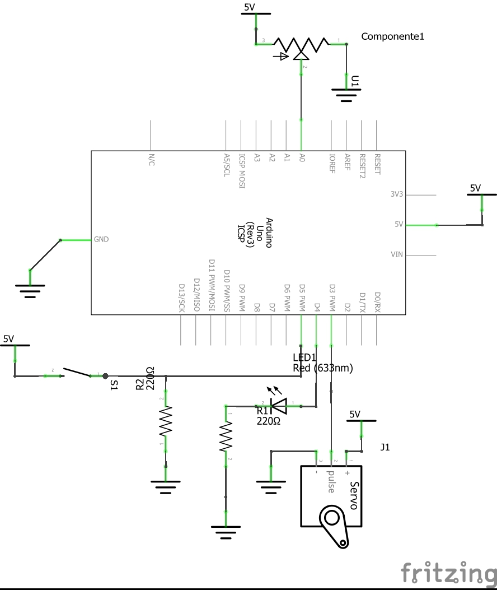

1. Overview
1. Retrieving a list of available Serial Ports.  Example 1
1. Handling streams of data in C# and Arduino. Example 2

## Overview

The way we have handled the communication with over the Serial Port worked fine, as long as the user knows what Serial Port is the good one and the Arduino is connected in order for the operative system to make it available.

If you try to run the GUI application we've been building so far and the Arduino is not connected the program will just crash, no intuitive error message will be displayed, and the user doesn't have any choice about what port to use, it is **hardcoded** in the application.

In this lecture we are going to see how to retrieve a list of ports and display this list in a control called Combo Box so the user can pick up the Serial Port he wants to use.

And finally we are going to communicate with the Arduino sending streams of data instead of single character commands, as a example I'll build a little app that controls the degrees of movement of a Servomotor using a GUI with a Trackbar (Slide Bar).

Examples 2 and 3 in this page use the same Hardware as we've been using for a while, this is:

The protoboard view is in this picture


And the schematic is


## Retrieving a list of available Serial Ports. Example 1

In C# using .Net Framework 4.5 you can retrieve a list of available Serial ports using the method:

```
System.IO.Ports.SerialPort.GetPortNames();
```

That method returns a list of available serial ports in your computer.

The next example code for C# will only retrieve a list of serial ports available in the computer, will expose them in a ComboBox control and when the user clicks one of them a message box will pop up with the port name.

You can find the code at: [https://github.com/hmojicag/hmojicag-hmi-examples/tree/master/HMI4-ListSerialPorts/ListSerialPorts](https://github.com/hmojicag/hmojicag-hmi-examples/tree/master/HMI4-ListSerialPorts/ListSerialPorts)

This is the design view of the windows:


As you can see there's only one control which is a ComboBox named comboBox1.
It has an Event Handler for the behaviour **SelectedIndexChanged**.
The form has an Event Handler for the **Load** behaviour

Here next is the code of this Form window

```
using System;
using System.Windows.Forms;
using System.IO.Ports;

namespace ListSerialPorts {
    public partial class Form1 : Form {
        public Form1() {
            InitializeComponent();
            
        }

        private void Form1_Load(object sender, EventArgs e) {
            string[] availablePorts = SerialPort.GetPortNames();
            comboBox1.Items.Add("Select a Serial Port");
            foreach(string port in availablePorts) {
                comboBox1.Items.Add(port);
            }
            comboBox1.SelectedIndex = 0;
        }

        private void comboBox1_SelectedIndexChanged(object sender, EventArgs e) {
            if(comboBox1.SelectedIndex > 0) {
                //If the user selected a valid Serial Port from the list
                string portName = comboBox1.SelectedItem.ToString();
                MessageBox.Show("You selected the Serial Port: " + portName);
            }
        }
    }
}
```

The code si simple, when the form is just loaded it will retrieve a list of Serial Ports as a `string[]` array. Then it will iterate that array and add to the combobox all the items of this array which are the Port Names available in the computer at that time.
Take a close look at the code, you can see we are adding an item with a text `"Select a Serial Port"`, and then we order the combobox to select that item with `comboBox1.SelectedIndex = 0;`, this is just to make this option the default one and to make the user know he needs to choose a valid Serial Port from the list.

Thanks to the event handler SelectedIndexChanged, we can trigger the method comboBox1_SelectedIndexChanged each time the user selects a Serial Port from the list. There's a validation though, it will only pop up a box with the port name if the user select a valid Serial Port, this is, a Serial Port which index is not '0' because the item 0 is the `"Select a Serial Port"` text.

Here are some images of the app working:

This is the window with the combo box showing the list of serial ports


And when you select one of them the message pops up


## Handling streams of data in C# and Arduino. Example 2

Now we are going to build a more robust application by sending and receiving streams of data. This is, we leave the "simple" command based approach for sending data to the arduino and expecting a unique value in return for each command and we attack using a streams based approach.

The complete code is in: [https://github.com/hmojicag/hmojicag-hmi-examples/tree/master/HMI4-Ex2](https://github.com/hmojicag/hmojicag-hmi-examples/tree/master/HMI4-Ex2)

### Preparing your Arduino for receiving streams of data

The code in the next sketch will make your Arduino receive commands in a data stream fashion and will also return via Serial a response with the same format.

This format is c-v&
c is a command
v is the value for such command
& is a separator

```
/*
* Hazael Fernando Mojica García
* 22/August/2017
* HMI-4-C#-Streams
* Open a Serial connection at 115200 bds
* Commands:
* 1 Set LED
* 2 Set PWM
* 3 Read Digital Val at pinPush
* 4 Read Analog val at pinPotA
* Commands should be send in the next format:
* &c-v&
* c is the command number
* v is the value for such command
* & is a separator
* For example: &1-1& will turn the LED ON while &1-0& will turn it off.
* &2-120&3-0& will set the PWM to 120 and return the digital status
* of the pin pinPush.
* You can concatenate as many commands as you want as long as you
* respect the format &c-v&
*/

int pinServo = 3;
int pinLED = 4;
int pinPush = 5;
int pinPotA = 0;

//A buffer to store the incoming serial data
String commandBuffer = "";
String valueBuffer = "";
int appendStatus = 0;      //0 No append
                           //1 Append to command
                           //2 Append to value

void setup() {
  Serial.begin(115200);
  pinMode(pinServo, OUTPUT);//PWM pin as output
  pinMode(pinLED, OUTPUT);
  pinMode(pinPush, INPUT);
}

void loop() {
  readSerialBuffer();
}

void readSerialBuffer() {
  if(Serial.available()) {    
    char character = Serial.read();
    if(character == '&') {
      //We got a & separator
      //Execute the last command in buffer if valid
      executeCommand();
      appendStatus = 1;
    } else if (character == '-') {
      appendStatus = 2;
    } else {
      append2Buffer(character);
    }
  }
}

void append2Buffer(char val2append) {
  if(appendStatus == 1) {
    commandBuffer += val2append;
  } else if (appendStatus == 2) {
    valueBuffer += val2append;
  }
}

void executeCommand() {
  int command = commandBuffer.toInt();
  int value = valueBuffer.toInt();
  executeCommandImpl(command, value);
  commandBuffer = "";
  valueBuffer = "";
}

void executeCommandImpl(int command, int value) {
  //By convention the command 0 is an invalid command
  switch(command) {
    case 1://set LED
      setLEDval(value);
    break;
    
    case 2://set servo PWM
      setPWMVal(value);
    break;
  
    case 3://Read Digital Val
      readDigitalVal();
    break;
  
    case 4://Read Analog Value
      readAnalogVal();
    break;
  }
}

void setLEDval(int stat) {
  if(stat) {
    digitalWrite(pinLED, HIGH);
    Serial.print("led-HIGH&");
  } else {
    digitalWrite(pinLED, LOW);
    Serial.print("led-LOW&");
  }
}

void setPWMVal(int val) {
  analogWrite(pinServo, val);
  Serial.print("pwm-");
  Serial.print(val);
  Serial.print("&");
}

void readDigitalVal() {
  if(digitalRead(pinPush)) {
    Serial.print("digital-HIGH&");
  } else {
    Serial.print("digital-LOW&");
  }
}

void readAnalogVal() {
  Serial.print("analog-");
  Serial.print(analogRead(pinPotA));
  Serial.print("&");
}
```

How do we use it?

Load the sketch to your Arduino, and open the Serial Monitor.
If you send the stream of data: `"&1-1&1-1&2-100&2-200&2-0&3-0&4-0&"`


You will command the Arduino to:
* Turn the LED On
* Turn the LED Off
* Set PWM to 100
* Set PWM to 200
* Set PWM to 0
* Read digital status
* Read analog value

Now you can see how the response of the Arduino is very similar to the syntax you are using for sending the commands: `led-HIGH&led-LOW&pwm-100&pwm-200&pwm-0&digital-LOW&analog-472&`.

This is going to be useful at the time of building the C# application for parsing those responses and act accordingly.

### Building the GUI in C#

Create a new Windows Forms Application in Visual Studio.
Add the controls to the form:
* ComboBox for selecting a SerialPort
* Checkbox and label for controlling the LED
* Trackbar and Label for controlling PWM (Servomotor)
* Label for displaying push button status
* Label for displaying Analog value
* A Timer object
* A SerialPort object

You can also add some Group Boxes to have your controls grouped by function. This is useful if you want to enable/disable a group of controls at the same time.

Here is an image of my Form with all the controls:


You will need to add some Event Handlers to the Buttons, Checkbox and Timer.

Here is the code that handles all the the logic behind the Form, as you can read it is very intuitive which method corresponds to what Event Handler for a specific control.

```
using System;
using System.Windows.Forms;
using System.IO.Ports;
using System.Collections.Generic;

namespace HMI4_Ex2_GUI {
    public partial class Form1 : Form {
        private Queue<CVPair> dataQueue;
        private string incomeBuffer;
        public Form1() {
            InitializeComponent();
        }

        private void Form1_Load(object sender, EventArgs e) {
            comboBox1.Items.Clear();
            //Add a default Message to the combo box
            comboBox1.Items.Add("Select a Serial Port");
            //Fill the ComboBox with the names of the Serial Ports
            string[] availableSerialPorts = SerialPort.GetPortNames();
            foreach(string portName in availableSerialPorts) {
                comboBox1.Items.Add(portName);
            }
            //Choose the "Select a Serial Port" msg for display
            comboBox1.SelectedIndex = 0;
            //Disable Controls Group Box
            groupBox_controls.Enabled = false;
            //Initialize Income data Queue
            dataQueue = new Queue<CVPair>();
            incomeBuffer = string.Empty;
        }

        private void trackBar_pwm_ValueChanged(object sender, EventArgs e) {
            //Send command to Set PWM to trackbar value
            SendData(2, trackBar_pwm.Value);
        }

        private void button_connect_Click(object sender, EventArgs e) {
            if(comboBox1.SelectedIndex > 0) {
                //A valid Serial Port has been selected
                serialPort1.BaudRate = 115200;
                serialPort1.PortName = comboBox1.SelectedItem.ToString();
                try {
                    serialPort1.Open();
                } catch (Exception ex) {
                    timer1.Stop();
                    Console.WriteLine(ex);
                    MessageBox.Show("Error connection to port: "
                        + serialPort1.PortName);
                    this.Close();
                }
                //enable the timer
                timer1.Enabled = true;
                timer1.Start();
                //Swap Group Box
                groupBox_connection.Enabled = false;
                groupBox_controls.Enabled = true;
            }
        }

        private void checkBox_LED_CheckedChanged(object sender, EventArgs e) {
            if(checkBox_LED.Checked) {
                SendData(1, 1);//Send LED command ON
            } else {
                SendData(1, 0);//Send LED command OFF
            }
        }

        private void timer1_Tick(object sender, EventArgs e) {
            bool dataSent;
            dataSent = SendData(3);//Send Read Digital command
            dataSent = dataSent | SendData(4);//Send Read Analog command

            if(!dataSent) {
                //Error sending data, stop Tick
                timer1.Stop();
                timer1.Enabled = false;
                MessageBox.Show("Error sending data to the Arduino");
                this.Close();
            }
            ParseBuffer();
            RefreshGUI();
        }

        private void Form1_FormClosing(object sender, FormClosingEventArgs e) {
            timer1.Stop();
            timer1.Enabled = false;
            serialPort1.Close();
        }

        private void ParseBuffer() {
            //This is the tricky code that stores all data received
            //parses and stores it in a List of command value pairs
            try {
                if (serialPort1.IsOpen) {
                    //Read everything the Arduino has sent so far
                    incomeBuffer += serialPort1.ReadExisting();
                }
                //Split string into c-v pairs
                //For example: "digital-HIGH&analog-512&led-HIGH&"
                //will be split in { "digital-HIGH", "analog-512", "led-HIGH", ""}
                string[] cvPairs = incomeBuffer.Split('&');
                incomeBuffer = cvPairs[cvPairs.Length - 1];
                for (int i = 0; i < (cvPairs.Length-1); i++) {
                    string[] cvPair = cvPairs[i].Split('-');
                    if(cvPair.Length == 2) {
                        //If the pair has not exactly 2 elements
                        //a command and a value, discard it
                        CVPair pair = new CVPair();
                        pair.Command = cvPair[0];
                        pair.Value = cvPair[1];
                        dataQueue.Enqueue(pair);
                        Console.WriteLine("Command Enqued: " + cvPairs[i]);
                    } else {
                        Console.WriteLine("Command Discarded: " + cvPairs[i]);
                    }
                }
            } catch(Exception ex) {
                timer1.Stop();
                timer1.Enabled = false;
                Console.WriteLine(ex);
                MessageBox.Show("Error reading data from the Arduino");
                this.Close();
            }
        }

        private void RefreshGUI() {
            foreach(CVPair pair in dataQueue) {
                switch(pair.Command) {
                    case "led":
                        label_LED.Text = "LED Status: " + pair.Value;
                        break;
                    case "pwm":
                        label_PWM.Text = "PWM Val: " + pair.Value;
                        break;
                    case "digital":
                        label_Digital.Text = "Push Button Status: " + pair.Value;
                        break;
                    case "analog":
                        //Convert to Double the ADC value
                        double adcVal = Convert.ToDouble(pair.Value);
                        //The ADC maps the 0 to 5v in 10bits (0 to 1023)
                        double volts = adcVal * 5.0 / 1023.0;
                        label_Analog.Text = "Voltage: " + volts.ToString("##.##") + "V";
                        break;
                    default:
                        Console.WriteLine("Not a recognized response command: " + pair.Command);
                        break;
                }
            }
        }

        private bool SendData(int command) {
            return SendData(command, 0);
        }

        private bool SendData(int command, int value) {
            bool allOk = false;
            if(serialPort1.IsOpen) {
                try {
                    string request = "&" + command + "-" + value + "&";
                    serialPort1.Write(request);
                    Console.WriteLine("Request sent: " + request);
                    allOk = true;
                } catch(Exception ex) {
                    Console.WriteLine(ex);
                }
            }

            return allOk;
        }

        private class CVPair {
            public string Command { get; set; }
            public string Value { get; set; }
        }
    }
}
```

It may could be really frightening to see so many lines of code, specially when we haven't programmed that many in our past examples but it was really needed in order to make a full functional example.

### Putting all together

Here is a screenshot of the GUI working:


When you press the buttons for sending commands to the Arduino board, it acts accordingly and sends back to the GUI a response, C# parses the response and show the results in the window.