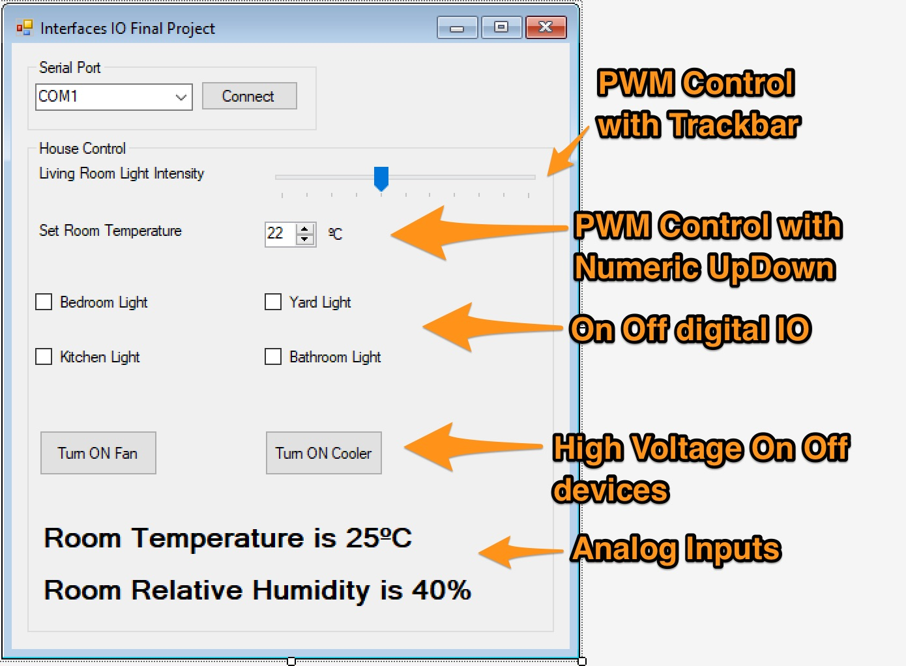
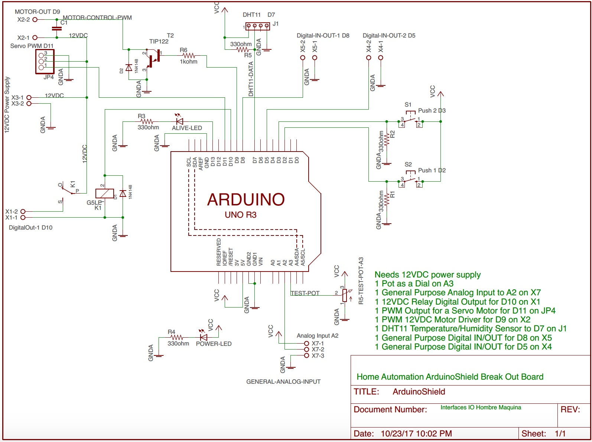
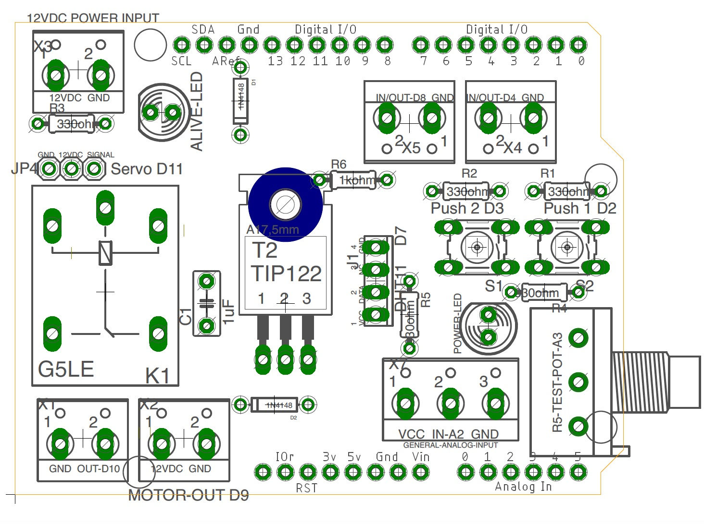
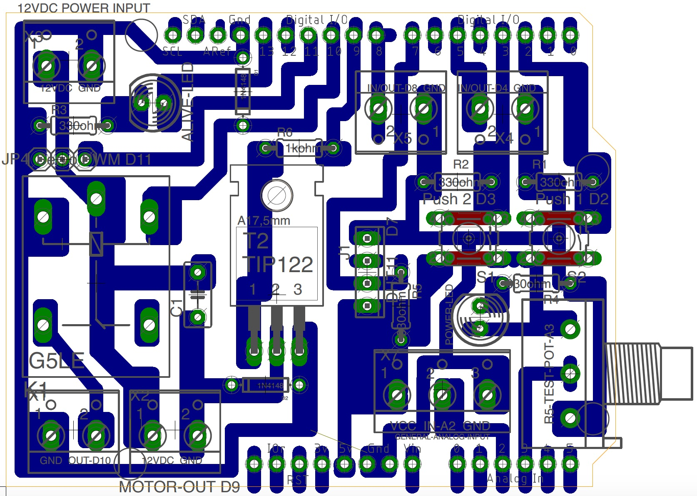

## [Final Project](#header-2)


The final project for this course is building a GUI (Graphical User Interface) for controlling an Arduino powered board via Serial UART interface. The main goal is **Home Automation / Domotics** .

The arduino board will have attached to it the **Multiple IO Break Out Board** described below in order to leverage the hardware interface of the different sensors and actuators providing a more robust environment than a simple Protoboard.

### Requirements

1. Control at least 1 DC High Voltage (More than 5DCV) ON/OFF device ([Fan](http://www.steren.com.mx/ventilador-de-4-pulgadas-12-vcc-de-plastico.html), [Peltier Cooler](https://www.sparkfun.com/products/10080), Light Bulb).
1. At least 1 PWM Actuator (Servomotors, Outrunner Motor, Stepper Motor, DC Motor).
1. At least 1 Environmental Data (Temperature, Humidity, Light).
1. At least 2 Button commanded inputs.

### The Windows Forms GUI

The GUI must comply with the minimum requirements for building an intuitive and comprehensive User Interface.
These are:

1. User should be control every aspect of the house using the common controls (Buttons, Checkboxes, Radio Buttons, TrackBars and so on).
1. User must see in the GUI just what he needs to see, No complicated configurations, no over complicated controls (using for example a TextBox for controlling a PWM driven actuator is a bad idea because you let the user wonder what must be inside the textbox, an angle?, a Duty Cycle Value?, a Distance?, better use a TrackBar).
1. Deal with errors in a proper way. If an Exception is triggered let the user know an error has happened and if possible continue working or if it's not then close the application in a safe way, not just fail silently and quit the application unexpectedly.
1. Use a minimalistic approach when building GUI, you may use a the common Windows Forms controls but try to think in the final user, what's he expecting from the GUI, what he's use to and how he uses it.

Some examples of an acceptable GUI would be:




### Multiple IO Break Out Board

In order to make it easier for you to have finished the project in time here's a Break Out Board that can fit in a Arduino Board models UNO and Mega.

**Schematic:** [PDF]({{ site.baseurl }})


**Silk Screen - Components Layout:** [PDF]({{ site.baseurl }})


**Full Board:** [PDF]({{ site.baseurl }})


**Eagle Files** [SCH]({{ site.baseurl }}), [BRD]({{ site.baseurl }})

**BOM**
* 1x PCB; PC-10X10
* 1x KIT HEADER FOR ARDUINO SHIELD; HEADER-1
* 1x TERMINALS 3 Screws; TRT-03
* 5x TERMINALS 2 Screws; TRT-02
* 2x MICROSWITCH PUSH MINI 1 MM 4 PINS; PUSH-1
* 5x RESISTOR 330 OHM (1/4, 1/8 watt); RC-330E/1/8
* 1x RESISTOR 1 KOHM (1/4, 1/8 watt); RC-1k/1/8
* 1x RELAY (SPDT) 5DVC COIL; RAS-0510
* 2x DIODE 100V 75MA; 1N4148
* 2x LED Green DIP 5mm
* 1x TIP122 Darlington TO-220
* 1x Ceramic Capacitor 0.1uF
* 1x Potentiomenter 10kohm
* 1x DHT11 Temperature/Humidity sensor

Some useful lectures:
* [Home Automation](https://en.wikipedia.org/wiki/Home_automation)
* [Sparkfun Relay Tutorial](https://www.sparkfun.com/tutorials/119)
* [Tutorial Motor Control](http://www.instructables.com/id/Use-Arduino-with-TIP120-transistor-to-control-moto/)
* [Tutorial Power Control](http://bildr.org/2011/03/high-power-control-with-arduino-and-tip120/)
* [DTH11 Library for Arduino](https://playground.arduino.cc/Main/DHT11Lib)
* [Tutorial DTH11 with Arduino](http://www.circuitbasics.com/how-to-set-up-the-dht11-humidity-sensor-on-an-arduino/)


### Demo Code for the Break Out Board

```
/*
 * Human Machine Interface
 * Break Out Board Demo Code
 * By: Hazael Mojica
 * Monterrey, NL, México. 25/10/2017
 */
#include <dht.h>
#include <Servo.h>
dht DHT;
Servo servo;

//Here define all pins
#define LED_ALIVE_PIN           13
#define SERVO_PIN               11
#define RELAY_PIN               10
#define DHT11_PIN               9
#define IN_OUT_1_PIN            8
#define PWM_MOTOR_CONTROL_PIN   6
#define IN_OUT_2_PIN            5
#define PUSH_1_PIN              2
#define PUSH_2_PIN              3

#define ANALOG_POT_DIAL_PIN     3
#define ANALOG_GP_IN            2

//Here define work intervals
unsigned int intervalDHT11 = 1000; //ms DHT11
unsigned int interlvalA3 = 250; //ms Pot Dial
unsigned int interlvalA2 = 200; //ms A2
unsigned int intervalAliveLED = 300; //ms Alive LED D13

unsigned long currentMillis = 0;
unsigned long pastMillisDHT11 = 0;
unsigned long pastMillisA3 = 0;
unsigned long pastMillisA2 = 0;
unsigned long pastMillisAliveLED = 0;

//Here are the global variables
float humidity;
float temperature;
boolean aliveLEDStatus = HIGH;
int pwmMotorVal = 125;
int servoPosDegrees = 0;


void setup() {
  //Init Serial communications
  Serial.begin(115200);
  //Alive LED
  pinMode(LED_ALIVE_PIN, OUTPUT);
  //Servo init
  servo.attach(SERVO_PIN);
  //Push Pins
  pinMode(PUSH_1_PIN, INPUT);
  pinMode(PUSH_2_PIN, INPUT);
}

void loop() {
  checkSerialCommand();
  checkWorkSchedule();
}

void checkSerialCommand() {
  if(Serial.available()) {
    switch(Serial.read()) {
      case 'a': //Get Temperature
        Serial.print("Temperature: ");
        Serial.println(temperature);
      break;
      case 'b': //Get Humidity
        Serial.print("Humidity: ");
        Serial.println(humidity);
      break;
      case 'c': //Increase PWM Motor Val
        increaseMotorPWMVal();
      break;
      case 'd': //Decrease PWM Motor Val
        decreaseMotorPWMVal();
      break;
      case 'e': //Increase Servo Pos
        increaseServoPos();
      break;
      case 'f': //Decrease Servo Pos
        decreaseServoPos();
      break;
      case 'g': //Turn ON Relay PIN
        relayPinChangeState(HIGH);
      break;
      case 'h': //Turn OFF Relay PIN
        relayPinChangeState(LOW);
      break;
      case 'i': //Read POT
        readPotDial();
      break;
      case 'j': //Read Push PIN 1
        readPushButton(PUSH_1_PIN);
      break;
      case 'k': //Read Push PIN 2
        readPushButton(PUSH_2_PIN);
      break;
            
    }
  }
}

void checkWorkSchedule() {
  currentMillis = millis();

  if((currentMillis - pastMillisAliveLED) >= intervalAliveLED) {
    blinkAliveLED();
    pastMillisAliveLED = currentMillis;
  }

  if((currentMillis - pastMillisDHT11) >= intervalDHT11) {
    getDHT11Lecture();
    pastMillisDHT11 = currentMillis;
  }
}

void blinkAliveLED() {
  aliveLEDStatus = 1 - aliveLEDStatus;
  digitalWrite(LED_ALIVE_PIN, aliveLEDStatus);
}

void getDHT11Lecture() {
  int chk = DHT.read11(DHT11_PIN);
  temperature = (float) DHT.temperature;
  humidity = (float) DHT.humidity;
}

void increaseServoPos() {
  servoPosDegrees += 5;
  if(servoPosDegrees > 180) {
    servoPosDegrees = 180;
  }
  Serial.print("Servo Pos: ");
  Serial.println(servoPosDegrees);
  servo.write(servoPosDegrees);
}

void decreaseServoPos() {
  servoPosDegrees -= 5;
  if(servoPosDegrees < 0) {
    servoPosDegrees = 0;
  }
  Serial.print("Servo Pos: ");
  Serial.println(servoPosDegrees);
  servo.write(servoPosDegrees);
}

void increaseMotorPWMVal() {
  pwmMotorVal += 5;
  if(pwmMotorVal > 255) {
    pwmMotorVal = 255;
  }
  analogWrite(PWM_MOTOR_CONTROL_PIN, pwmMotorVal);
  Serial.print("PWM Motor Val: ");
  Serial.println(pwmMotorVal);
}

void decreaseMotorPWMVal() {
  pwmMotorVal -= 5;
  if(pwmMotorVal < 0) {
    pwmMotorVal = 0;
  }
  analogWrite(PWM_MOTOR_CONTROL_PIN, pwmMotorVal);
  Serial.print("PWM Motor Val: ");
  Serial.println(pwmMotorVal);
}

void relayPinChangeState(int state) {
    digitalWrite(RELAY_PIN, state);
    Serial.print("Relay PIN: ");
    Serial.println(state);
}

void readPotDial() {
    Serial.print("POT Dial: ");
    Serial.println(analogRead(ANALOG_POT_DIAL_PIN));
}

void readPushButton(int pushPin) {
    Serial.print("Push Button ");
    Serial.print(pushPin);
    Serial.println(digitalRead(pushPin));
}
```

### PCB Prototyping

Do you want the PCB board and all the components ready to use? Contact:
[Field Effect Electronics](https://www.facebook.com/FieldEffectElectronics)

### Evaluation

* 30% GUI (minimum standards)
* 30% Hardware (Clean and well build)
* 10% High Voltage output Working Full
* 10% PWM driven device Working Full
* 10% Enviromental Data via ADC working Full
* 10% Buttons and Dial Commanded Inputs working Full

A Report in PDF must be loaded into Moodle.
