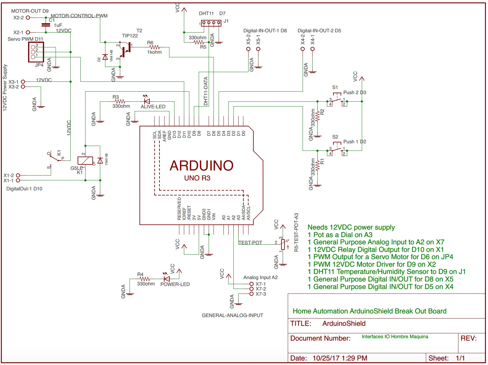
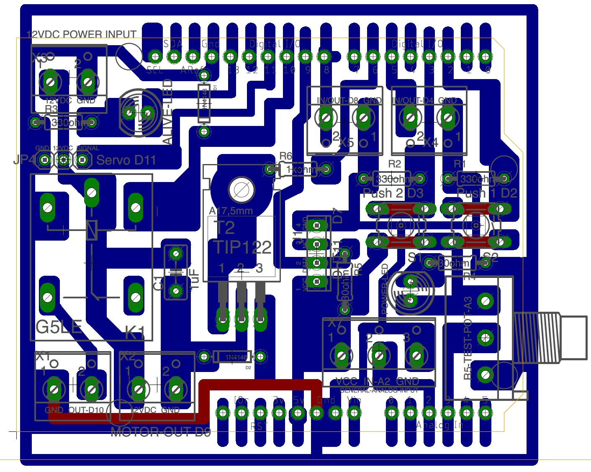

## [Final Project](#header-2)

The final project for this course is building a GUI (Graphical User Interface) for controlling an Arduino powered board via Serial UART interface. The main goal is **Home Automation / Domotics** .

The arduino board will have attached to it the **Multiple IO Break Out Board** described below in order to leverage the hardware interface of the different sensors and actuators providing a more robust environment than a simple Protoboard.

### Requirements

1. Control at least 1 DC High Voltage (More than 5DCV) ON/OFF device ([Fan](http://www.steren.com.mx/ventilador-de-4-pulgadas-12-vcc-de-plastico.html), [Peltier Cooler](https://www.sparkfun.com/products/10080), Light Bulb).
1. At least 1 PWM Actuator (Servomotors, Outrunner Motor, Stepper Motor, DC Motor).
1. At least 1 Environmental Data (Temperature, Humidity, Light).
1. At least 2 Button commanded inputs.

### The Windows Forms GUI

The GUI must comply with the minimum requirements for building an intuitive and comprehensive User Interface.
These are:

1. User should be control every aspect of the house using the common controls (Buttons, Checkboxes, Radio Buttons, TrackBars and so on).
1. User must see in the GUI just what he needs to see, No complicated configurations, no over complicated controls (using for example a TextBox for controlling a PWM driven actuator is a bad idea because you let the user wonder what must be inside the textbox, an angle?, a Duty Cycle Value?, a Distance?, better use a TrackBar).
1. Deal with errors in a proper way. If an Exception is triggered let the user know an error has happened and if possible continue working or if it's not then close the application in a safe way, not just fail silently and quit the application unexpectedly.
1. Use a minimalistic approach when building GUI, you may use a the common Windows Forms controls but try to think in the final user, what's he expecting from the GUI, what he's use to and how he uses it.

Some examples of an acceptable GUI would be:

### Multiple IO Break Out Board and Hardware

In order to make it easier for you to have finished the project in time here's a Break Out Board that can fit in a Arduino Board models UNO and Mega.

**Schematic:** [PDF]({{ site.baseurl }})

**Silk Screen - Components Layout:** [PDF]({{ site.baseurl }})

**Full Board:** [PDF]({{ site.baseurl }})

**BOM**
* 1x PCB; PC-10X10
* 1x KIT HEADER FOR ARDUINO SHIELD; HEADER-1
* 3x TERMINALS 3 Screws; TRT-03
* 5x TERMINALS 2 Screws; TRT-02
* 2x MICROSWITCH PUSH MINI 1 MM 4 PINS; PUSH-1
* 2x RESISTOR 330 OHM (1/4, 1/8 watt); RC-330E/1/8
* 2x RELAY (SPDT) 5DVC COIL; RAS-0510
* 2x DIODE 100V 75MA; 1N4148

Some useful lectures:
* [Home Automation](https://en.wikipedia.org/wiki/Home_automation)
* [Sparkfun Relay Tutorial](https://www.sparkfun.com/tutorials/119)

### PCB Prototyping

Do you want the PCB board and all the components ready to use? Contact:
[Field Effect Electronics](https://www.facebook.com/FieldEffectElectronics)

### Evaluation

* 30% GUI (minimum standards)
* 30% Hardware (Clean and well )
* 10% High Voltage output Working Full
* 10% PWM driven device Working Full
* 10% Enviromental Data via ADC working Full
* 10% 2 Button Commanded Inputs working Full

A Report in PDF must be loaded into Moodle.
