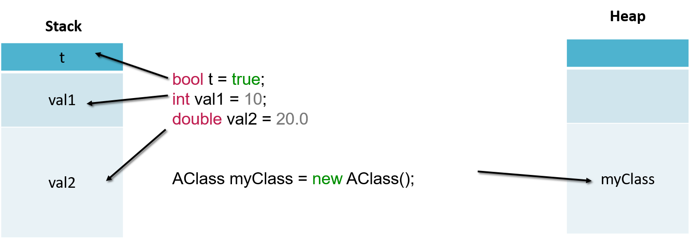
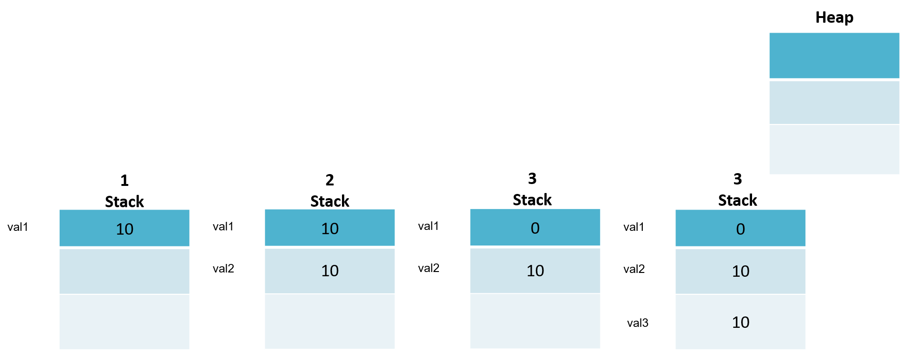
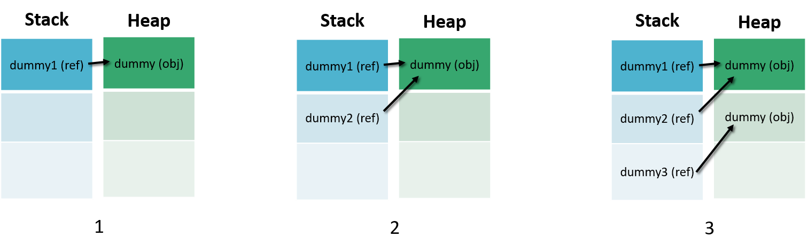
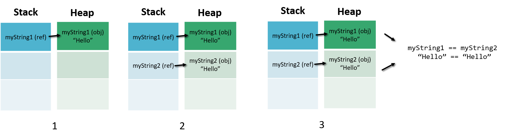

# Session 1 - Introduction to C# and .Net Core

1. What's .Net Core
1. Run a Hello World
1. Variables
1. Strings
1. Common built-in data types in C#
1. Arithmetic
1. Decisions with if...else
1. Loops
1. Arrays and Lists
1. Object Oriented Programming: Class and fields
1. Methods
1. Constructors
1. Access Modifiers and Access Levels
1. Instantiating Classes
1. Inheritance
1. Interfaces
1. Abstract Classes
1. Reference Types vs Value Types

## What's .Net Core
[.NET Core](https://docs.microsoft.com/en-us/dotnet/core/about) is an open-source, general-purpose development platform maintained by Microsoft and the .NET community on GitHub. It's cross-platform (supporting Windows, macOS, and Linux) and can be used to build device, cloud, and IoT applications.

**.NET Core** is an [open-source](https://github.com/dotnet/coreclr/blob/master/LICENSE.TXT), general-purpose development platform maintained by Microsoft and the .NET community on [GitHub](https://github.com/dotnet/core). It's cross-platform (supporting Windows, macOS, and Linux) and can be used to build device, cloud, and IoT applications.

See [About .NET Core](https://docs.microsoft.com/en-us/dotnet/core/about) to learn more about .NET Core, including its characteristics, supported languages and frameworks, and key APIs. [Reference](https://docs.microsoft.com/en-us/dotnet/core/)


Image coming from [here](https://codeburst.io/what-you-need-to-know-about-asp-net-core-30fec1d33d78)

## Run a Hello World

You must already have installed .Net Core, see [here](https://dotnet.microsoft.com/learn/dotnet/hello-world-tutorial/install) for how to do it.

We will create a new Console project called HelloWorldApp and run it:

```csharp
  mkdir HelloWorldApp
  cd HelloWorldApp
  dotnet new console
  dotnet run
```

## Variables

A variable is the main object were to store values in the high level programming languages. A variable is a space in memory, the smaller size is 1 byte and it could be as large as needed. Variables allow us to store, manipulate and display data.

A variable is a symbol you can use to run the same code with different values.

```csharp
string aFriend = "Bill";
Console.WriteLine(aFriend);
```

The first line declares a variable, aFriend and assigns it a value, "Bill". The second line prints out the name.
You can assign different values to any variable you declare. You can change the name to one of your friends.

```csharp
aFriend = "Maira";
Console.WriteLine(aFriend);
```

Notice that the same line of code prints two different messages, based on the value stored in the aFriend variable.
You may have also noticed that the word "Hello" was missing in the last two messages. Let's fix that now. Modify the lines that print the message to the following:

```csharp
Console.WriteLine("Hello " + aFriend);
Console.WriteLine($"Hello {aFriend}");
```

[Reference](https://docs.microsoft.com/en-us/dotnet/csharp/tutorials/intro-to-csharp/hello-world?tutorial-step=2)

## Strings

You've been using a method, [Console.WriteLine](https://docs.microsoft.com/en-us/dotnet/api/system.console.writeline), to print messages. A method is a block of code that implements some action. It has a name, so you can access it.

Suppose your strings have leading or trailing spaces that you don't want to display. You want to trim the spaces from the strings. The [Trim](https://docs.microsoft.com/en-us/dotnet/api/system.string.trim) method and related methods TrimStart and TrimEnd do that work. You can just use those methods to remove leading and trailing spaces. Try the following code:

```csharp
string greeting = "      Hello World!       ";
Console.WriteLine($"[{greeting}]");

string trimmedGreeting = greeting.TrimStart();
Console.WriteLine($"[{trimmedGreeting}]");

trimmedGreeting = greeting.TrimEnd();
Console.WriteLine($"[{trimmedGreeting}]");

trimmedGreeting = greeting.Trim();
Console.WriteLine($"[{trimmedGreeting}]");
```

[Reference](https://docs.microsoft.com/en-us/dotnet/csharp/tutorials/intro-to-csharp/hello-world?tutorial-step=4)

The other part of a search and replace operation is to find text in a string. You can use the Contains method for searching. It tells you if a string contains a substring inside it. Try the following code to explore [Contains](https://docs.microsoft.com/en-us/dotnet/api/system.string.contains):

```
string songLyrics = "You say goodbye, and I say hello";
Console.WriteLine(songLyrics.Contains("goodbye"));
Console.WriteLine(songLyrics.Contains("greetings"));
```

There are two similar methods, [StartsWith](https://docs.microsoft.com/en-us/dotnet/api/system.string.startswith) and [EndsWith](https://docs.microsoft.com/en-us/dotnet/api/system.string.endswith) that also search for sub-strings in a string. These find a substring at the beginning or the end of the string. Try to modify the previous sample to use StartsWith and EndsWith instead of Contains. Search for "You" or "goodbye" at the beginning of a string. Search for "hello" or "goodbye" at the end of a string.

## Common built-in data types in C#
The following table shows the keywords for built-in C# types, which are aliases of predefined types in the <xref:System> namespace.  

|C# type|.NET type|  
|--------------|-------------------------|  
|[bool](bool.md)|<xref:System.Boolean?displayProperty=nameWithType>|  
|[byte](byte.md)|<xref:System.Byte?displayProperty=nameWithType>|  
|[sbyte](sbyte.md)|<xref:System.SByte?displayProperty=nameWithType>|  
|[char](char.md)|<xref:System.Char?displayProperty=nameWithType>|  
|[decimal](decimal.md)|<xref:System.Decimal?displayProperty=nameWithType>|  
|[double](double.md)|<xref:System.Double?displayProperty=nameWithType>|  
|[float](float.md)|<xref:System.Single?displayProperty=nameWithType>|  
|[int](int.md)|<xref:System.Int32?displayProperty=nameWithType>|  
|[uint](uint.md)|<xref:System.UInt32?displayProperty=nameWithType>|  
|[long](long.md)|<xref:System.Int64?displayProperty=nameWithType>|  
|[ulong](ulong.md)|<xref:System.UInt64?displayProperty=nameWithType>|  
|[object](object.md)|<xref:System.Object?displayProperty=nameWithType>|  
|[short](short.md)|<xref:System.Int16?displayProperty=nameWithType>|  
|[ushort](ushort.md)|<xref:System.UInt16?displayProperty=nameWithType>|  
|[string](string.md)|<xref:System.String?displayProperty=nameWithType>|  

[Reference](https://docs.microsoft.com/en-us/dotnet/csharp/language-reference/keywords/reference-tables-for-types)

## Arithmetic
The C# language defines the precedence of different mathematics operations with rules consistent with the rules you learned in mathematics. Multiplication and division take precedence over addition and subtraction.

```csharp
int a = 5;
int b = 4;
int c = 2;
int d = a + b * c;
Console.WriteLine(d);
```

The output demonstrates that the multiplication is performed before the addition.
You can force a different order of operation by adding parentheses around the operation or operations you want performed first:

```csharp
int a = 5;
int b = 4;
int c = 2;
int d = (a + b) * c;
Console.WriteLine(d);
```
[Reference](https://docs.microsoft.com/en-us/dotnet/csharp/tutorials/intro-to-csharp/numbers-in-csharp?tutorial-step=2)


**Explore integer precision and limits**

The C# integer type differs from mathematical integers in one other way: the **int** type has minimum and maximum limits. Run this code in the interactive window to see those limits:

```csharp
int max = int.MaxValue;
int min = int.MinValue;
Console.WriteLine($"The range of integers is {min} to {max}");
```

If a calculation produces a value that exceeds those limits, you have an underflow or overflow condition. The answer appears to wrap from one limit to the other.

```csharp
int what = max + 3;
Console.WriteLine($"An example of overflow: {what}");
```
[Reference](https://docs.microsoft.com/en-us/dotnet/csharp/tutorials/intro-to-csharp/numbers-in-csharp?tutorial-step=3)

**Work with the double type**

The **double** numeric type represents a double-precision floating point number. Those terms may be new to you. A floating point number is useful to represent non-integral numbers that may be very large or small in magnitude.

```csharp
double a = 5;
double b = 4;
double c = 2;
double d = (a  + b) / c;
Console.WriteLine(d);
```

[Reference](https://docs.microsoft.com/en-us/dotnet/csharp/tutorials/intro-to-csharp/numbers-in-csharp?tutorial-step=4)

## Decisions with if...else

As in any other programming language C# has if ... else statements to branch the execution flow of the program and take decisions.

Because indentation is not significant, you need to use **{** and **}** to indicate when you want more than one statement to be part of the block that executes conditionally. C# programmers typically use those braces on all **if** and **else** clauses.

```csharp
int a = 5;
int b = 3;
if (a + b > 10)
{
    Console.WriteLine("The answer is greater than 10");
}
else
{
    Console.WriteLine("The answer is not greater than 10");
}
```

You can test more complicated conditions:


```csharp
int a = 5;
int b = 3;
int c = 4;
if ((a + b + c > 10) && (a == b))
{
    Console.WriteLine("The answer is greater than 10");
    Console.WriteLine("And the first number is equal to the second");
}
else
{
    Console.WriteLine("The answer is not greater than 10");
    Console.WriteLine("Or the first number is not equal to the second");
}
```

The **==** symbol tests for equality. Using **==** distinguishes the test for equality from assignment, which you saw in **a = 5**.

The **&&** represents **"and"**. It means both conditions must be true to execute the statement in the true branch. These examples also show that you can have multiple statements in each conditional branch, provided you enclose them in { and }.

You can also use **||** to represent **"or"**.

[Reference](https://docs.microsoft.com/en-us/dotnet/csharp/tutorials/intro-to-csharp/branches-and-loops?tutorial-step=2)

## Loops

Another important concept to create larger programs is loops. You'll use loops to repeat statements that you want executed more than once.

```csharp
int counter = 0;
while (counter < 10)
{
  Console.WriteLine($"Hello World! The counter is {counter}");
  counter++;
}
```
The **while** statement checks a condition and executes the statement following the while. It will repeat checking the condition and executing those statements until the condition is false.

Another common loop statement that you'll see in C# code is the for **loop**.

```csharp
for(int counter = 0; counter < 10; counter++)
{
  Console.WriteLine($"Hello World! The counter is {counter}");
}
```
[Reference](https://docs.microsoft.com/en-us/dotnet/csharp/tutorials/intro-to-csharp/branches-and-loops?tutorial-step=3)

## Arrays and Lists

**Arrays**
You can store multiple variables of the same type in an **array data structure**.

```csharp
type[] arrayName;
```

The following example creates single-dimensional, multidimensional, and jagged arrays:

```csharp
class TestArraysClass
{
    static void Main()
    {
        // Declare a single-dimensional array
        int[] array1 = new int[5];

        // Declare and set array element values
        int[] array2 = new int[] { 1, 3, 5, 7, 9 };

        // Alternative syntax
        int[] array3 = { 1, 2, 3, 4, 5, 6 };

        // Declare a two dimensional array
        int[,] multiDimensionalArray1 = new int[2, 3];

        // Declare and set array element values
        int[,] multiDimensionalArray2 = { { 1, 2, 3 }, { 4, 5, 6 } };

        // Declare a jagged array
        int[][] jaggedArray = new int[6][];

        // Set the values of the first array in the jagged array structure
        jaggedArray[0] = new int[4] { 1, 2, 3, 4 };
    }
}
```

**In C#, arrays are actually objects,** and not just addressable regions of contiguous memory as in C and C++. [Array](https://docs.microsoft.com/en-us/dotnet/api/system.array) is the abstract base type of all array types. You can use the properties, and other class members, that Array has. An example of this would be using the [Length](https://docs.microsoft.com/en-us/dotnet/api/system.array.length) property to get the length of an array

```csharp
int[] numbers = { 1, 2, 3, 4, 5 };
int lengthOfNumbers = numbers.Length;
```

[Reference](https://docs.microsoft.com/en-us/dotnet/csharp/programming-guide/arrays/)

**Lists**

Represents a strongly typed list of objects that can be accessed by index. Provides methods to search, sort, and manipulate lists.

The following example demonstrates how to add, remove, and insert a simple business object in a [List<T>](https://docs.microsoft.com/en-us/dotnet/api/system.collections.generic.list-1?view=netcore-2.2).

```csharp
List<string> fruits = new List<string>();
fruits.Add("apple");
fruits.Add("orange");
fruits.Add("pear");
Console.WriteLine(fruits[0]);
foreach(string fruit in fruits) {
  Console.WriteLine(fruit);
}
```
[Reference](https://docs.microsoft.com/en-us/dotnet/api/system.collections.generic.list-1?view=netcore-2.2)

## Object Oriented Programming: Classes and fields

C# provides full support for object-oriented programming including encapsulation, inheritance, and polymorphism.

**Encapsulation** means that a group of related properties, methods, and other members are treated as a single unit or object.

**Inheritance** describes the ability to create new classes based on an existing class.

**Polymorphism** means that you can have multiple classes that can be used interchangeably, even though each class implements the same properties or methods in different ways.

The terms class and object are sometimes used interchangeably, but in fact, classes describe the type of objects, while objects are usable instances of classes. So, the act of creating an object is called instantiation. Using the blueprint analogy, a class is a blueprint, and an object is a building made from that blueprint.


To define a class:
```csharp
class SampleClass
{
}
```
**Properties and Fields**
Fields and properties represent information that an object contains. Fields are like variables because they can be read or set directly.

To define a field:

```csharp
class SampleClass
{
    public string sampleField;
}
```
Properties have get and set procedures, which provide more control on how values are set or returned.

C# allows you either to create a private field for storing the property value or use so-called auto-implemented properties that create this field automatically behind the scenes and provide the basic logic for the property procedures.

To define an auto-implemented property:
```csharp
class SampleClass
{
    public int SampleProperty { get; set; }
}
```

If you need to perform some additional operations for reading and writing the property value, define a field for storing the property value and provide the basic logic for storing and retrieving it:

```csharp
class SampleClass
{
    private int _sample;
    public int Sample
    {
        // Return the value stored in a field.
        get { return _sample; }
        // Store the value in the field.
        set { _sample = value; }
    }
}
```

## Methods
A method is an action that an object can perform.

To define a method of a class:

```csharp
class SampleClass
{
    public int sampleMethod(string sampleParam)
    {
        // Insert code here
    }
}
```

A class can have several implementations, or overloads, of the same method that differ in the number of parameters or parameter types.

To overload a method:
```csharp
public int sampleMethod(string sampleParam) {};
public int sampleMethod(int sampleParam) {}
```

## Constructors

Constructors are class methods that are executed automatically when an object of a given type is created. Constructors usually initialize the data members of the new object. A constructor can run only once when a class is created. Furthermore, the code in the constructor always runs before any other code in a class. However, you can create multiple constructor overloads in the same way as for any other method.

To define a constructor for a class:
```csharp
public class SampleClass
{
    public SampleClass()
    {
        // Add code here
    }
}
```
## Access Modifiers and Access Levels

All classes and class members can specify what access level they provide to other classes by using access modifiers.

The following access modifiers are available:
The following six accessibility levels can be specified using the access modifiers:
* **public**: Access is not restricted.
* **protected**: Access is limited to the containing class or types derived from the containing class.
* **internal**: Access is limited to the current assembly.
* **protected internal**: Access is limited to the current assembly or types derived from the containing class.
* **private**: Access is limited to the containing type.
* **private protected**: Access is limited to the containing class or types derived from the containing class within the current assembly.

## Instantiating Classes

To create an object, you need to instantiate a class, or create a class instance.

```csharp
SampleClass sampleObject = new SampleClass();
```

After instantiating a class, you can assign values to the instance's properties and fields and invoke class methods.

```csharp
// Set a property value.
sampleObject.sampleProperty = "Sample String";
// Call a method.
sampleObject.sampleMethod();
```

To assign values to properties during the class instantiation process, use object initializers:

```csharp
// Set a property value.
SampleClass sampleObject = new SampleClass
    { FirstProperty = "A", SecondProperty = "B" };
```

## Inheritance

Inheritance enables you to create a new class that reuses, extends, and modifies the behavior that is defined in another class. The class whose members are inherited is called the *base class*, and the class that inherits those members is called the *derived class*. However, all classes in C# implicitly inherit from the <xref:System.Object> class that supports .NET class hierarchy and provides low-level services to all classes.

> [!NOTE]
> C# doesn't support multiple inheritance. That is, you can specify only one base class for a derived class.

To inherit from a base class:

```csharp
class DerivedClass:BaseClass {}
```
### Overriding Members

By default, a derived class inherits all members from its base class. If you want to change the behavior of the inherited member, you need to override it. That is, you can define a new implementation of the method, property or event in the derived class.

The following modifiers are used to control how properties and methods are overridden:

|C# Modifier|Definition|
|------------------|----------------|
|[virtual](../../../csharp/language-reference/keywords/virtual.md)|Allows a class member to be overridden in a derived class.|
|[override](../../../csharp/language-reference/keywords/override.md)|Overrides a virtual (overridable) member defined in the base class.|
|[abstract](../../../csharp/language-reference/keywords/abstract.md)|Requires that a class member to be overridden in the derived class.|
|[new Modifier](../../../csharp/language-reference/keywords/new-modifier.md)|Hides a member inherited from a base class|

## Interfaces

Interfaces, like classes, define a set of properties, methods, and events. But unlike classes, interfaces do not provide implementation. They are implemented by classes, and defined as separate entities from classes. An interface represents a contract, in that a class that implements an interface must implement every aspect of that interface exactly as it is defined.

To define an interface:

```csharp
interface ISampleInterface
{
    void doSomething();
}
```

To implement an interface in a class:

```csharp
class SampleClass : ISampleInterface
{
    void ISampleInterface.doSomething()
    {
        // Method implementation.
    }
}
```

For more information, see:

[Interfaces](../../../csharp/programming-guide/interfaces/index.md)

[interface](../../../csharp/language-reference/keywords/interface.md)

[Reference](https://docs.microsoft.com/en-us/dotnet/csharp/programming-guide/concepts/object-oriented-programming)

## Reference Types vs Value Types

There are two kinds of types in C#: value types and reference types. Variables of value types directly contain their data whereas variables of reference types store references to their data, the latter being known as objects. With reference types, it is possible for two variables to reference the same object and thus possible for operations on one variable to affect the object referenced by the other variable. With value types, the variables each have their own copy of the data, and it is not possible for operations on one to affect the other (except in the case of ref and out parameter variables).



**Stack** is used for static memory allocation and **Heap** for dynamic memory allocation, both stored in the computer's RAM .


### Value types

```csharp
//"Value Types" hold the actual value in the Stack
//They are statically created on compilation with a
//fixed size
1 int val1 = 10;
2 int val2 = val1;
3 val1 = 0;
4 int val3 = val2;
5 Console.WriteLine(
$"val1: {val1}, val2: {val2}, val3: {val3},");
```



### Reference types

```csharp
//"Reference Types" are hold on the Heap
1 DummyClass dummy1 = new DummyClass();
2 DummyClass dummy2 = dummy1;
3 DummyClass dummy3 = new DummyClass();
4 dummy1.DummyProperty = "Hello";
5 dummy3.DummyProperty = "Hello";
if (dummy1 == dummy2) {
 Console.WriteLine("dummy1 & dummy2 point to the same object");
}
if (dummy1 == dummy3) {
 Console.WriteLine("dummy1 & dummy3 DO NOT point to the same object");
}


private class DummyClass {
 public string DummyProperty
  {get; set;}
}
```



### The Exception to the rule: The “string”

A String object is a reference typed object. But a string is special in C#, when comparing two string objects they are always compared as values.

```csharp
1 string myString1 = "Hello";
2 string myString2 = "Hello";
3 if (myString1 == myString2) {
 Console.WriteLine("Both string are equals");
}
```


[Reference](https://docs.microsoft.com/en-us/dotnet/csharp/tour-of-csharp/types-and-variables)

[Go to Session 2 --->]({{ site.baseurl }})
