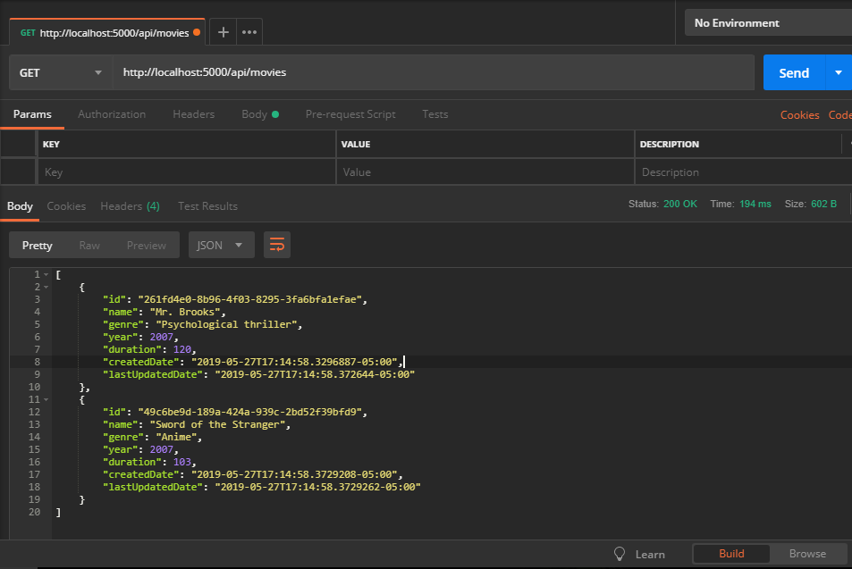
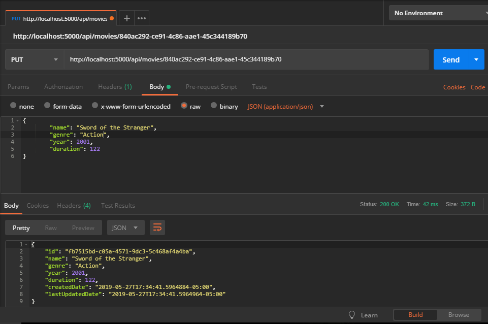

# Session 2 - HTTP and ASP.Net Core

1. Networking basics for Web Developers
1. Introduction to HTTP for Web Developers
1. Introduction to ASP.Net Core
1. Our first Hello World Web API
1. Defining the Basic Endpoints for our API (Request/response object, status codes and headers)
1. HTTP Conventions for our API
1. Building the Models and Controllers
1. Sharing the API with other devices in the LAN
1. Connecting a database for persisting the data
1. Introduction to EF Core

## Networking basics for Web Developers

As a web developer we are going to develop applications that live in the Application layer of the OSI model.
We are not going to worry about how the data (a web page, a JSON payload, a JPG image...) is transited over the network and that is going the make it easy for us to focus in our task, which is build an API that users can consume.

Although we need to understand some of the basics of HTTP and networking so we can troubleshoot problems if they arise or just to have them as general knowledge.

Remember **HTTP** is a request/response protocol, and every request and it's correspondent response are stateless, it means they do not store any session related information.
As an example, imagine you have a web server which only you can access, nobody else can, then you request a web page from that web server (at least one request/response) is made between the client (your web browser) and the server, this page is a Poll for evaluating somebody, you fill all the fields in the poll then you click the submit button that sends data to the server and refreshes the page, the server will treat each request separately and should not try to relate them, every request must contain enough information within to tell the server what to do (user info, data...).


[Reference](https://microchipdeveloper.com/tcpip:tcp-ip-five-layer-model)

## Introduction to HTTP for Web Developer

See [this HTTP presentation](https://drive.google.com/open?id=1GMkh4y9zXNYoBcKUdpH7dAFjwIU4vBTy)

[Reference](https://developer.mozilla.org/en-US/docs/Web/HTTP)

## Introduction to ASP.Net Core

ASP.NET is a popular web-development framework for building web apps on the .NET platform.

ASP.NET Core is the open-source version of ASP.NET, that runs on macOS, Linux, and Windows. ASP.NET Core was first released in 2016 and is a re-design of earlier Windows-only versions of ASP.NET.

Open a terminal and run the next commands:

```csharp
mkdir webAppTest
cd webAppTest
dotnet new webApp --no-https
dotnet run
```

The previous commands will create a new project based on a standard web app template and launch it, you can see it in action in your browser by going to **localhost:5000**.

Our **Web API** will use the same framework (ASP.Net Core) that is used for **Web Apps** with the difference that instead of returning web pages based on a template or a View (Razor Pages) we are going to return Data (a Json representation).

[Reference](https://dotnet.microsoft.com/learn/web/what-is-aspnet-core)

## Our first Hello World Web API

Open a terminal and run the next commands for creating a new Web API project based on a the standard project template provided by Microsoft.

```csharp
mkdir MoviesWebApi
cd MoviesWebApi
dotnet new webapi --no-https
dotnet run
```

Open postman and make a request to:

```
GET http://localhost:5000/api/Values
```

You will get hardcoded values:

```
[
    "value1",
    "value2"
]
```

## Defining the Basic Endpoints for our API (Request/response object, status codes and headers)

Here below is the web API we are going to create

|API | Description | Request body | Response body | Status Codes
|--- | ---- | ---- | ---- |---- |
|GET /api/movies | Get all movies | None | Array of movies| 200
|GET /api/movies/{id} | Get a movie by ID | None | movie| 200, 404
|POST /api/movies | Add a new movie | movie | movie | 201, 422, 400
|PUT /api/movies/{id} | Update an existing movie | movie | movie | 200, 404, 422, 400
|DELETE /api/movies/{id} | Delete a movie | None | None| 204, 404


## HTTP Conventions for our API

### API naming conventions
By convention the names of the endpoints must be **nouns**, that is, they must be **things**, not actions. And the should be plural.
For example:

```
GET api/getMovies           # This is bad
GET api/movies              # This is good

GET api/{id}/movie          # This is bad
GET api/movies/{id}         # This is good

GET api/actorsOfMovie/{id}  # This is bad
GET api/movies/{id}/actors  # This is good
```

### HTTP common status codes

It is good to return the appropriate status code according to request type and response. I list here the most common response status codes.

#### Level 200
* 200 - Ok.         (Request fulfilled)
* 201 - Created.    (Successfully created)
* 204 - No Content. (Successfully created, No content returned)

### Level 400 Client Mistakes (Errors)
* 400 - Bad Request (Generic bad request response)
* 401 - Unauthorized (User is not logged in)
* 403 - Forbidden (User is logged in but has no permissions)
* 422 - Unprocessable entity (Semantic mistakes, failed validations)

### Level 500 Server Mistakes (Faults)
* 500 - Internal Server Error

## Building the Models and Controllers

Using the project we have just created using the **webapi** template create a `src` folder and move the `Controllers` inside it (It's not mandatory but I like to keep all my code insie an src folder).

Now Create a folder called `src/Models` and inside it a class called `Movie`.
This class is going to be entity we are trying to manipulate (Get, Create, Update, Delete), this class will also serve as Model for mapping to a Table in a SQL Server database.

`src/Models/Movie.cs`
```csharp
using System;

namespace MoviesWebApi.Models {
    public class Movie {

        public Movie() {
            Id = Guid.NewGuid().ToString();
            CreatedDate = DateTime.Now;
            LastUpdatedDate = DateTime.Now;
        }

        // This field is going to be recognized automatically by
        // EF Core as the Primary Key of the table
        public string Id { get; set; }

        public string Name { get; set; }

        public string Genre { get; set; }

        public int Year { get; set; }

        public int Duration { get; set; }

        // These fields are here to know when this record
        // was first created and when it was last updated
        public DateTime CreatedDate { get; set; }

        public DateTime LastUpdatedDate { get; set; }
    }
}
```

Now let's create the **Controller** for handling all the HTTP request.
In the folder `src/Controllers` create a new class called `MoviesController`:

`src/Controllers/MoviesController.cs`
```csharp
using System.Collections.Generic;
using Microsoft.AspNetCore.Mvc;
using MoviesWebApi.Models;

namespace MoviesWebApi.Controllers {

    [Route("api/movies")]
    [ApiController]
    public class MoviesController : ControllerBase {

        [HttpGet]
        //GET api/movies
        public ActionResult<IEnumerable<Movie>> GetAllMovies() {
            List<Movie> movies = new List<Movie>();
            Movie mrBrooks = new Movie();
            mrBrooks.Name = "Mr. Brooks";
            mrBrooks.Genre = "Psychological thriller";
            mrBrooks.Year = 2007;
            mrBrooks.Duration = 120;

            Movie sword = new Movie() {
                Name = "Sword of the Stranger",
                Genre = "Anime",
                Year = 2007,
                Duration = 103
            };

            movies.Add(mrBrooks);
            movies.Add(sword);

            return movies;
        }

        [HttpGet("{id}")]
        //GET api/movies/{id}
        public ActionResult<Movie> GetMovie(string id) {
            Movie sword = new Movie() {
                Name = "Sword of the Stranger",
                Genre = "Anime",
                Year = 2007,
                Duration = 103
            };

            return sword;
        }

        [HttpPost]
        //POST api/movies
        //Payload: A Json representing the Movie object
        public ActionResult<Movie> CreateMovie(Movie movie) {
            return movie;
        }

        [HttpPut("{id}")]
        //PUT api/movies/{id}
        //Payload: A Json representing the Movie object
        public ActionResult<Movie> UpdateMovie(Movie movie) {
            return movie;
        }
    }
}
```

As you can see, the controller will not persist any data, and will only provide hardcoded static information.

Open postman and test all the requests, here I put also the `curl` equivalent:

**Get All movies**
```
curl -X GET \
  http://localhost:5000/api/movies \
```


**Create a movie**
```
curl -X POST \
  http://localhost:5000/api/movies \
  -H 'Content-Type: application/json' \
  -H 'cache-control: no-cache' \
  -d '{
        "name": "Le fabuleux destin d Amelie Poulain",
        "genre": "Comedy",
        "year": 2001,
        "duration": 122
    }'
```


**Get a movie**
```
curl -X GET \
  http://localhost:5000/api/movies/840ac292-ce91-4c86-aae1-45c344189b70
```


**Update a movie**
```
curl -X PUT \
  http://localhost:5000/api/movies/840ac292-ce91-4c86-aae1-45c344189b70 \
  -H 'Content-Type: application/json' \
  -d '{
        "name": "Sword of the Stranger",
        "genre": "Action",
        "year": 2001,
        "duration": 122
}'
```

